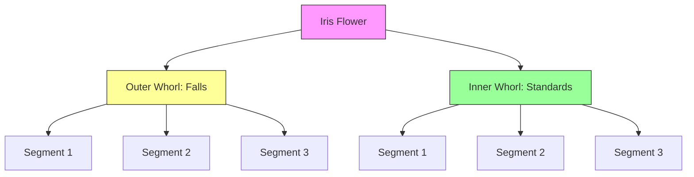
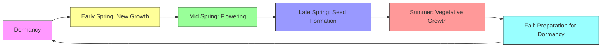

# Morphology & Structure

The iris flower exhibits a **unique and complex morphology** that has fascinated botanists for centuries. Understanding the structure of irises helps in their identification, cultivation, and appreciation.

## Flower Structure

The iris flower is composed of **six perianth segments** arranged in two whorls of three, with a distinctive structure that sets it apart from other flowering plants.

### Perianth Segments



### Detailed Anatomy

#### 1. Falls (Outer Perianth Segments)

```
Falls Structure:
├── Limb (Upper part)
│   ├── Shape: Typically ovate or obovate
│   └── Color: Often different from the claw
├── Claw (Narrow base)
│   └── Function: Connects to the ovary
└── Signal (Central marking)
    ├── Pattern: Veining, spots, or patches
    └── Function: Guides pollinators to nectar
```

> **Beard**: In bearded irises, the **falls** have a **velvety patch** called the beard, which consists of **specialized trichomes** (hair-like structures). This beard may serve multiple functions:
> - **Tactile guide** for pollinators
> - **Visual signal** with contrasting colors
> - **Nectar guide** leading to reproductive organs

#### 2. Standards (Inner Perianth Segments)

```
Standards Structure:
├── Shape: Typically upright or slightly curved
├── Size: Usually smaller than falls
├── Color: Often matches or complements falls
└── Function: Attracts pollinators from a distance
```

#### 3. Style Arms (Modified Stamens)

The iris has **three style arms** that are actually **modified stamens** (staminoids):

```
Style Arm Structure:
├── Petaloid Segment
│   ├── Appearance: Resembles a small petal
│   └── Color: Often matches standards
├── Stigma
│   ├── Location: At the tip
│   └── Function: Receives pollen
└── Crest (in some species)
    └── Ridge or flap instead of a beard
```

### Reproductive Organs

#### Ovary
- **Position**: Inferior (below the perianth)
- **Shape**: Three-chambered
- **Function**: Contains ovules
- **Maturation**: Develops into a capsule fruit

#### Stamens
- **Number**: Three (opposite the style arms)
- **Position**: Hidden beneath the style arms
- **Anthers**: Produce pollen
- **Filaments**: Slender stalks supporting anthers

## Leaf Structure

### Leaf Types

| **Type** | **Description** | **Species** |
|----------|-----------------|-------------|
| **Ensiform** | Sword-shaped, flat | Most bearded irises |
| **Equitant** | Overlapping at base | Some beardless irises |
| **Cylindrical** | Round, hollow | Bulbous irises |
| **Falcate** | Sickle-shaped | Some Asian species |

### Leaf Anatomy

```
Leaf Cross-Section:
├── Epidermis (Upper)
│   ├── Cuticle: Waxy layer
│   └── Stomata: Gas exchange (lower surface)
├── Mesophyll
│   ├── Palisade layer: Photosynthesis
│   └── Spongy layer: Gas exchange
└── Vascular Bundles
    ├── Xylem: Water transport
    └── Phloem: Nutrient transport
```

### Leaf Arrangement

```
Basal Rosette:
├── Fan-shaped arrangement
├── Overlapping at base
└── Emerges from rhizome

Caulinar Leaves:
├── Alternate arrangement
├── Smaller than basal leaves
└── On flowering stem
```

## Stem Structure

### Flowering Stem (Scape)

```
Scape Structure:
├── Height: Varies by species (4" to 48")
├── Shape: Round or slightly flattened
├── Color: Green, sometimes purple-tinged
├── Branching: Simple or branched
│   ├── Unbranched: Single flower or bud
│   └── Branched: Multiple flowers
└── Bracts: Modified leaves at branch points
```

### Rhizome Structure

```
Rhizome Anatomy:
├── External
│   ├── Color: Tan to brown
│   ├── Texture: Rough, fibrous
│   └── Roots: Fibrous, emerging from underside
└── Internal
    ├── Cortex: Storage tissue
    ├── Vascular bundles: Ring arrangement
    └── Pith: Central tissue
```

## Root Systems

### Rhizomatous Irises

```
Root System:
├── Primary Roots
│   ├── Thick, fleshy
│   └── Grow downward from rhizome
├── Secondary Roots
│   ├── Thin, fibrous
│   └── Spread horizontally
└── Root Hairs
    └── Increase surface area for absorption
```

### Bulbous Irises

```
Bulb Structure:
├── Tunic: Outer protective layer
├── Scales: Modified leaves (storage)
├── Basal Plate: Bottom of bulb
│   └── Roots emerge from here
└── Apical Bud: Growing point
```

## Color Patterns

### Pigment Types

| **Pigment** | **Color** | **Location** | **Chemical Class** |
|-------------|-----------|--------------|-------------------|
| Anthocyanins | Purple, Blue, Red | Petals | Flavonoids |
| Carotenoids | Yellow, Orange | Petals | Terpenoids |
| Flavones | White, Cream | Petals | Flavonoids |
| Chlorophyll | Green | Leaves, stems | Porphyrins |

### Color Distribution

The color patterns in iris flowers follow specific **genetic and environmental** factors:

$$\text{Color Intensity} = \frac{\text{Pigment Concentration} \times \text{Cell Structure}}{\text{Light Reflection}}$$

Where:
- **Pigment Concentration**: Amount of anthocyanins/carotenoids
- **Cell Structure**: Shape and arrangement of epidermal cells
- **Light Reflection**: How light interacts with petal surface

### Pattern Types

1. **Self** (Solid Color)
   - Uniform color throughout
   - Example: 'Blue Flag' (solid blue)

2. **Bicolor**
   - Different colors on standards and falls
   - Example: 'Conjuration' (yellow standards, purple falls)

3. **Bitone**
   - Different shades of the same color
   - Example: 'Sea Power' (light blue standards, dark blue falls)

4. **Plicata**
   - Stitched or dotted edges
   - Example: 'Honky Tonk Blues' (white with purple edges)

5. **Variegata**
   - Yellow or white with purple/red veining
   - Example: 'Variegata' (classic variety)

6. **Amoena**
   - White standards with colored falls
   - Example: 'Amoena' (white and purple)

7. **Neglecta**
   - Reverse amoena (colored standards, white falls)
   - Rare pattern

8. **Luminata**
   - Luminous, glowing appearance
   - Often with metallic sheen

## Growth Habits

### By Subgenus

| **Subgenus** | **Growth Habit** | **Height Range** | **Spread** |
|--------------|------------------|------------------|------------|
| Iris (Bearded) | Clump-forming | 6" - 48" | 12" - 24" per year |
| Limniris (Beardless) | Spreading | 12" - 48" | 18" - 36" per year |
| Xiphium (Bulbous) | Clump-forming | 4" - 12" | 3" - 6" per year |
| Nevskia | Clump-forming | 6" - 12" | 6" - 12" per year |
| Scorpiris | Clump-forming | 6" - 18" | 6" - 12" per year |
| Hermodactyloides | Clump-forming | 4" - 8" | 3" - 6" per year |

### Seasonal Growth Cycle



---

*See also: [Taxonomy](/iris/botany/taxonomy) | [Genetics](/iris/botany/genetics)*
