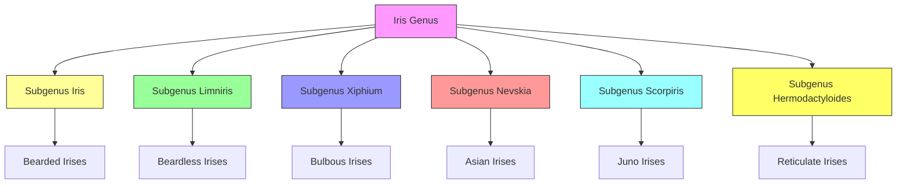

# Taxonomy & Classification

The *Iris* genus belongs to the **Iridaceae** family and is classified within the **Asparagales** order. With over 300 species, irises exhibit remarkable diversity in form, habitat, and color.

## Hierarchical Classification

```
Kingdom:     Plantae
  └── Clade:     Tracheophytes (Vascular Plants)
      └── Clade: Angiosperms (Flowering Plants)
          └── Clade: Monocots (Monocotyledons)
              └── Order: Asparagales
                  └── Family: Iridaceae
                      └── Subfamily: Iridoideae
                          └── Tribe: Irideae
                              └── Genus: Iris L. (1753)
```

## Subgenera Classification

The genus *Iris* is divided into **six subgenera**, each with distinct characteristics:

### 1. Subgenus *Iris* (Bearded Irises)

| **Characteristic** | **Description** |
|-------------------|-----------------|
| **Rhizome** | Thick, fleshy, grow at or below soil surface |
| **Falls** | Have a "beard" of fuzzy hairs |
| **Habitat** | Dry to moist, well-drained soils |
| **Distribution** | Europe, Middle East, Central Asia |
| **Examples** | *I. germanica*, *I. pallida*, *I. variegata* |

> **Fun Fact**: The "beard" on bearded irises is actually a **velvety patch of specialized cells** that may help guide pollinators to the nectar.

### 2. Subgenus *Limniris* (Beardless Irises)

| **Characteristic** | **Description** |
|-------------------|-----------------|
| **Rhizome** | Slender, creeping, grow below soil surface |
| **Falls** | Smooth, without beards |
| **Habitat** | Wetlands, marshes, stream banks |
| **Distribution** | Northern Hemisphere |
| **Examples** | *I. versicolor*, *I. pseudacorus*, *I. laevigata* |

### 3. Subgenus *Xiphium* (Bulbous Irises)

| **Characteristic** | **Description** |
|-------------------|-----------------|
| **Storage Organ** | True bulbs (not rhizomes) |
| **Foliage** | Grass-like, narrow leaves |
| **Bloom Time** | Early spring to early summer |
| **Distribution** | Mediterranean, Western Asia |
| **Examples** | *I. reticulata*, *I. histrio*, *I. danfordiae* |

### 4. Subgenus *Nevskia* (Asian Irises)

| **Characteristic** | **Description** |
|-------------------|-----------------|
| **Rhizome** | Slender, wiry |
| **Falls** | Small, often with signal patches |
| **Habitat** | Dry, rocky slopes |
| **Distribution** | Central Asia |
| **Examples** | *I. kolpakowskiana*, *I. bloudowii* |

### 5. Subgenus *Scorpiris* (Juno Irises)

| **Characteristic** | **Description** |
|-------------------|-----------------|
| **Storage Organ** | Bulbs with thick, fleshy roots |
| **Foliage** | Basal fans, often glaucous |
| **Bloom Time** | Spring |
| **Distribution** | Middle East, Central Asia |
| **Examples** | *I. bucHarica*, *I. junonia*, *I. orchioides* |

### 6. Subgenus *Hermodactyloides* (Reticulate Irises)

| **Characteristic** | **Description** |
|-------------------|-----------------|
| **Storage Organ** | Small, reticulate (net-veined) bulbs |
| **Size** | Dwarf (4-6 inches tall) |
| **Bloom Time** | Very early spring |
| **Distribution** | Eastern Mediterranean |
| **Examples** | *I. reticulata*, *I. histrioides*, *I. danfordiae* |

## Classification Key



## Phylogenetic Relationships

Recent genetic studies have revealed the evolutionary relationships between iris subgenera:

```
Iridaceae Family Tree:
├── Subfamily Isophysidoideae
├── Subfamily Geosiridoideae
├── Subfamily Crocoideae
└── Subfamily Iridoideae
    ├── Tribe Sisyrinchieae
    ├── Tribe Tigridieae
    ├── Tribe Trimezieae
    └── Tribe Irideae
        ├── Genus Belamcanda
        ├── Genus Hermodactylus
        └── Genus Iris
            ├── Subgenus Hermodactyloides (earliest diverging)
            ├── Subgenus Scorpiris
            ├── Subgenus Nevskia
            ├── Subgenus Xiphium
            ├── Subgenus Limniris
            └── Subgenus Iris (most recent)
```

## Hybrid Classification

In addition to natural species, irises have been extensively hybridized. The main hybrid groups include:

### Tall Bearded (TB)
- Height: 28" and taller
- Bloom size: Large (4"+)
- Example: 'Beverly Sills', 'Edith Wolford'

### Standard Dwarf Bearded (SDB)
- Height: 8-16"
- Bloom size: Medium
- Example: 'Blue Denim', 'Purple Hill'

### Intermediate Bearded (IB)
- Height: 16-27.5"
- Bloom size: Medium to large
- Example: 'Sugar Blues', 'Jesse's Song'

### Miniature Tall Bearded (MTB)
- Height: 16-27.5"
- Bloom size: Small to medium
- Example: 'Bit of Honey', 'Plicaticus'

### Border Bearded (BB)
- Height: 16-27.5"
- Bloom size: Medium
- Example: 'Acomet', 'Red Zinger'

### Miniature Dwarf Bearded (MDB)
- Height: Up to 8"
- Bloom size: Small
- Example: 'Blue Denim', 'Purple Hill'

---

## Nomenclature Rules

Iris species and cultivars follow specific naming conventions:

### Species Names
- **Binomial nomenclature**: *Genus species*
- **Authority**: Person who first described the species
- Example: *Iris germanica* L. (Linnaeus, 1753)

### Cultivar Names
- **Single quotes**: 'Cultivar Name'
- **Capitalization**: First letter of each word capitalized
- **Registration**: Must be registered with the American Iris Society
- Example: *Iris germanica* 'Beverly Sills'

### Hybrid Names
- **Format**: (Parent 1 × Parent 2) × Parent 3
- **Example**: (*I. germanica* × *I. pallida*) × 'Snow Queen'

---

*See also: [Morphology](/iris/botany/morphology) | [Genetics](/iris/botany/genetics)*
