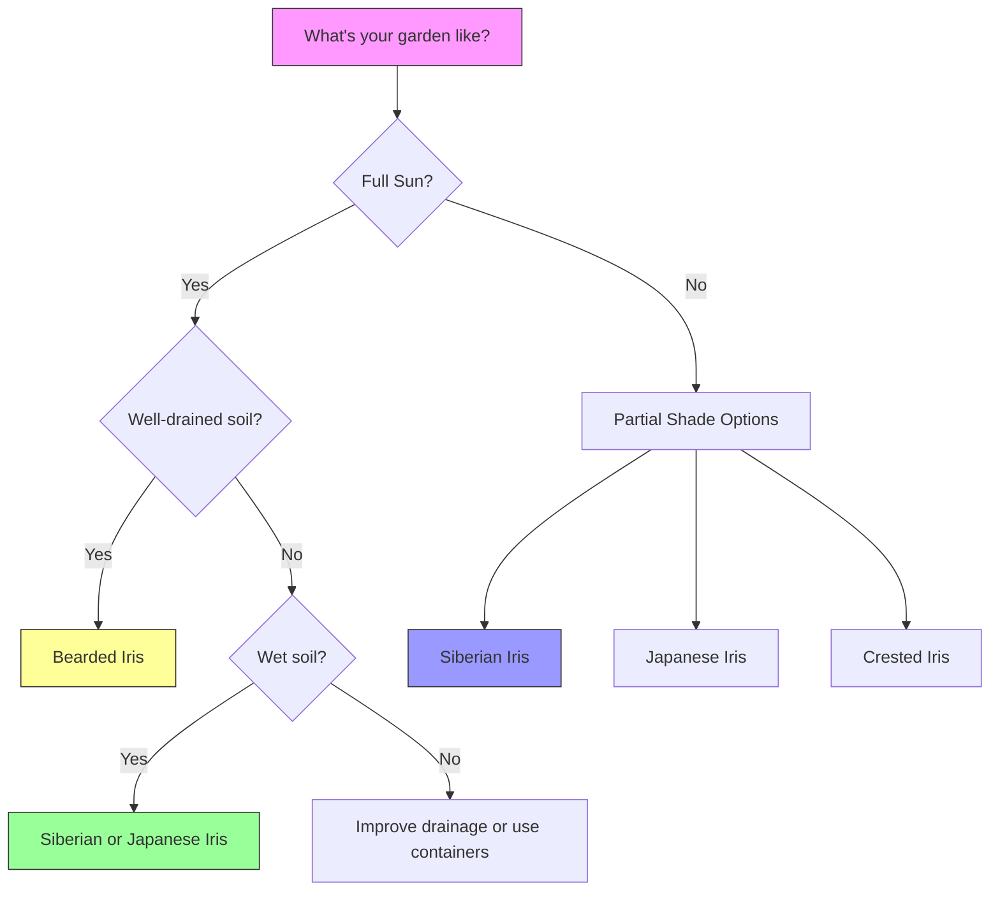

# Getting Started with Irises

> **"The best time to plant an iris is 20 years ago. The second best time is now."**
> — Adapted from Chinese Proverb


Irises are **surprisingly easy to grow** and will reward you with **years of beautiful blooms** with minimal care. This guide will walk you through everything you need to know to start your iris journey.

## Why Grow Irises?

✅ **Low Maintenance**: Once established, irises require little care
✅ **Long-Lived**: Can thrive for **decades** with proper care
✅ **Diverse**: Over 300 species and thousands of cultivars
✅ **Adaptable**: Varieties for every garden condition
✅ **Pollinator-Friendly**: Attracts bees and other beneficial insects
✅ **Cut Flowers**: Excellent for bouquets (some varieties)
✅ **Deer Resistant**: Most irises are **not** favored by deer

## Choosing the Right Iris

### For Beginners: Easiest to Grow

| **Type** | **Difficulty** | **Best For** | **Recommended Varieties** |
|----------|---------------|--------------|---------------------------|
| **Bearded Iris** | Easy | Sun, well-drained soil | 'Immortality', 'Blue Flag', 'Purple Hill' |
| **Siberian Iris** | Very Easy | Wet areas, partial shade | 'Caesar's Brother', 'Butter and Sugar' |
| **Japanese Iris** | Easy | Wetlands, ponds | 'Echo Location', 'Lion King' |
| **Dutch Iris** | Very Easy | Cut flowers, containers | 'Blue Magic', 'White Wedgwood' |
| **Reticulata Iris** | Easy | Early spring, rock gardens | 'Harmony', 'George', 'Katharine Hodgkin' |

### Quick Selection Guide



## When to Plant

### Best Planting Times

| **Region** | **Best Time to Plant** | **Alternative Times** | **Avoid** |
|------------|------------------------|----------------------|-----------|
| **Cold Climates** (Zones 3-5) | Late summer to early fall (Aug-Sept) | Early spring | Winter, late fall |
| **Moderate Climates** (Zones 6-8) | Early fall or early spring | Late fall, late winter | Summer heat |
| **Warm Climates** (Zones 9-11) | Fall to early winter | Very early spring | Summer, late spring |

> **💡 Pro Tip**: Plant **6 weeks before your first hard frost** to allow roots to establish before winter.

### Seasonal Planting Calendar

```
📅 Planting Schedule:
├── January: Zones 9-11 (warm climates)
├── February: Zones 8-11
├── March: Zones 7-10
├── April: Zones 6-9
├── May: Zones 5-8
├── June: Zones 4-7
├── July: Zones 3-6
├── August: Zones 3-7
├── September: Zones 3-8
├── October: Zones 4-9
├── November: Zones 7-11
└── December: Zones 9-11
```

## Where to Plant

### Sun Requirements

| **Iris Type** | **Minimum Sun** | **Ideal Sun** | **Maximum Shade Tolerance** |
|---------------|-----------------|---------------|-----------------------------|
| Bearded Iris | 6 hours | 6-8 hours | 50% shade (but may not bloom) |
| Siberian Iris | 4-6 hours | 6-8 hours | 70% shade |
| Japanese Iris | 4-6 hours | 6-8 hours | 70% shade |
| Dutch Iris | 6 hours | 6-8 hours | 50% shade |
| Reticulata Iris | 6 hours | 6-8 hours | 50% shade |
| Crested Iris | 4-6 hours | 4-6 hours | 80% shade |

### Soil Requirements

| **Factor** | **Bearded Iris** | **Beardless Iris** | **Bulbous Iris** |
|------------|------------------|-------------------|------------------|
| **pH** | 6.8-7.0 (slightly alkaline) | 5.5-6.5 (slightly acidic) | 6.0-7.0 (neutral) |
| **Drainage** | Excellent | Good to excellent | Excellent |
| **Texture** | Sandy loam | Clay loam | Well-draining |
| **Organic Matter** | Low to moderate | High | Moderate |
| **Moisture** | Dry to moderate | Moist to wet | Dry to moderate |

### Site Preparation Checklist

- [x] **Sunlight**: Measure sun exposure (6+ hours for most types)
- [x] **Soil Test**: Check pH and nutrient levels
- [x] **Drainage Test**: Dig a 12" hole, fill with water, check drainage rate
- [x] **Weed Control**: Remove all weeds from planting area
- [x] **Soil Amendment**: Add compost or sand as needed
- [ ] **Mark Location**: Use flags or spray paint to mark planting spots

## How to Plant

### Step-by-Step Planting Guide

#### For Rhizomatous Irises (Bearded, Siberian, Japanese, etc.)

```md
**Materials Needed**:
- Iris rhizomes
- Shovel or trowel
- Garden fork
- Compost or fertilizer (optional)
- Watering can
- Mulch (optional)

**Steps**:

1. **Prepare the Rhizome**
   - Trim leaves to **6-8 inches** (fan shape)
   - Remove any dead or damaged roots
   - Soak in water for **1-2 hours** (optional, helps rehydrate)

2. **Dig the Hole**
   - Depth: **2-4 inches deep**
   - Width: **12-18 inches wide**
   - Space: **12-24 inches apart** (closer for dwarf varieties)

3. **Create a Mound**
   - Make a small mound in the center of the hole
   - This prevents the rhizome from sitting in water

4. **Plant the Rhizome**
   - Place rhizome **on top of the mound**
   - Spread roots **downward and outward**
   - **Top of rhizome should be visible** at soil surface

5. **Backfill**
   - Cover roots with soil
   - **Do NOT cover the rhizome completely**
   - Gently firm the soil

6. **Water**
   - Water **thoroughly** after planting
   - Keep soil **moist but not soggy** for first 2 weeks

7. **Mulch (Optional)**
   - Apply **1-2 inches** of mulch
   - **Keep mulch away from rhizome** to prevent rot
```

#### For Bulbous Irises (Reticulata, Dutch, etc.)

```md
**Materials Needed**:
- Iris bulbs
- Trowel or bulb planter
- Bone meal or bulb fertilizer (optional)
- Watering can

**Steps**:

1. **Prepare the Bulb**
   - Choose **firm, plump bulbs**
   - Remove any loose scales or damaged areas

2. **Dig the Hole**
   - Depth: **4-6 inches deep** (3x the bulb height)
   - Space: **3-6 inches apart**

3. **Amend the Soil** (Optional)
   - Mix in **bone meal** or bulb fertilizer
   - Add **sand** if soil is heavy clay

4. **Plant the Bulb**
   - Place bulb **pointy end up**
   - Cover with soil
   - Gently firm the soil

5. **Water**
   - Water **thoroughly** after planting
   - Keep soil **moist during fall** (for spring bloomers)

6. **Mulch**
   - Apply **2-3 inches** of mulch
   - Helps **insulate** bulbs in winter
```

### Planting Depth Guide

```
Planting Depth Visual:

Bearded Iris Rhizome:
┌─────────────────────────────────┐
│         SOIL LEVEL ─────────────│ ← Top of rhizome should be visible
│                             ███│
│                          ███████│
│                       ███████████│ ← Rhizome
│                    █████████████│
│                 ████████████████│ ← Roots
└─────────────────────────────────┘

Bulbous Iris:
┌─────────────────────────────────┐
│         SOIL LEVEL ─────────────│
│                             ███│
│                          ███████│
│                       ███████████│ ← Bulb (4-6" deep)
│                    █████████████│
│                 ████████████████│
└─────────────────────────────────┘
```

## Container Planting

### Best Irises for Containers

| **Type** | **Container Size** | **Drainage** | **Care Level** |
|----------|-------------------|--------------|----------------|
| Dwarf Bearded | 8-12" diameter | Excellent | Easy |
| Reticulata | 6-8" diameter | Excellent | Very Easy |
| Dutch Iris | 8-10" diameter | Excellent | Easy |
| Siberian Iris | 12-16" diameter | Good | Moderate |
| Japanese Iris | 14-18" diameter | Good | Moderate |

### Container Planting Tips

```md
**Container Requirements**:
✅ **Drainage holes** (essential - irises hate wet feet!)
✅ **Lightweight potting mix** (avoid garden soil)
✅ **Size**: At least 8" deep for most varieties
✅ **Material**: Terracotta (breathable) or plastic (retains moisture)

**Potting Mix Recipe**:
- 40% High-quality potting soil
- 30% Perlite or pumice
- 20% Compost
- 10% Sand

**Care Tips**:
- Water when **top inch of soil is dry**
- Fertilize **monthly** during growing season
- **Divide** every 2-3 years
- **Overwinter**: Move to garage or insulate in cold climates
```

## After Planting Care

### First Two Weeks

- [x] **Water**: Keep soil **consistently moist** (not soggy)
- [x] **Check**: Ensure rhizomes/bulbs are **not covered** with soil
- [x] **Protect**: Guard against **pests** (slugs, snails)
- [ ] **Fertilize**: **Do NOT fertilize** immediately after planting

### First Month

- [x] **Water**: Reduce to **weekly deep watering**
- [x] **Weed**: Keep area **free of weeds**
- [x] **Monitor**: Watch for **new growth**
- [ ] **Fertilize**: Still **no fertilizer**

### First Year

- [x] **Water**: **1 inch per week** during growing season
- [x] **Remove**: Dead or yellow leaves
- [x] **Enjoy**: First blooms (if planted in fall)
- [ ] **Divide**: **Do NOT divide** in first year

---

## Common Beginner Mistakes

### ❌ **Planting Too Deep**
**Problem**: Rhizomes covered with soil rot
**Solution**: **Top of rhizome should be visible** at soil surface

### ❌ **Poor Drainage**
**Problem**: Rhizomes/bulbs rot in soggy soil
**Solution**: **Amend soil** with sand or plant on a slope

### ❌ **Too Much Shade**
**Problem**: Irises don't bloom or grow weakly
**Solution**: **Minimum 6 hours of sun** for most varieties

### ❌ **Over-Fertilizing**
**Problem**: Soft growth, susceptible to disease
**Solution**: **Low-nitrogen fertilizer** (6-10-10 or similar)

### ❌ **Wrong pH**
**Problem**: Bearded irises struggle in acidic soil
**Solution**: **Add lime** to raise pH to 6.8-7.0

### ❌ **Planting at Wrong Time**
**Problem**: Poor establishment, weak growth
**Solution**: **Plant in late summer/early fall** for best results

---

## Quick Start Checklist

```md
**Before You Begin**:
- [ ] Choose the right iris type for your garden
- [ ] Select a sunny location (6+ hours of sun)
- [ ] Test your soil drainage
- [ ] Purchase healthy rhizomes/bulbs
- [ ] Gather planting tools

**Planting Day**:
- [ ] Prepare the soil (amend if needed)
- [ ] Dig holes to correct depth
- [ ] Plant rhizomes/bulbs properly
- [ ] Water thoroughly
- [ ] Apply mulch (optional)

**After Planting**:
- [ ] Keep soil moist for first 2 weeks
- [ ] Monitor for pests
- [ ] Remove weeds regularly
- [ ] Plan for next season!
```

---

*Next: [Soil Preparation](/iris/cultivation/soil) | [Seasonal Care](/iris/cultivation/care)*
