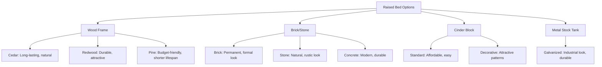

# Soil Preparation & Requirements

> **"The secret to growing great irises lies beneath the surface."**
> — Old Gardener's Saying


The **single most important factor** in successfully growing irises is **proper soil preparation**. Unlike many garden plants that tolerate a wide range of soil conditions, irises have **specific requirements** that must be met for them to thrive.

## Understanding Iris Soil Needs

### By Iris Type

| **Iris Type** | **Soil pH** | **Drainage** | **Texture** | **Moisture** | **Organic Matter** |
|---------------|-------------|--------------|-------------|--------------|-------------------|
| **Bearded Iris** | 6.8-7.0 (alkaline) | Excellent | Sandy loam | Dry to moderate | Low to moderate |
| **Siberian Iris** | 5.5-6.5 (acidic) | Good to excellent | Clay loam | Moist to wet | High |
| **Japanese Iris** | 5.5-6.5 (acidic) | Good | Clay loam | Wet to moist | High |
| **Louisiana Iris** | 5.5-6.5 (acidic) | Good | Loam | Wet to moist | High |
| **Dutch Iris** | 6.0-7.0 (neutral) | Excellent | Sandy loam | Dry to moderate | Moderate |
| **Reticulata Iris** | 6.0-7.0 (neutral) | Excellent | Well-draining | Dry to moderate | Moderate |
| **Crested Iris** | 5.5-6.5 (acidic) | Good | Loam | Moist | Moderate |

### The Ideal Iris Soil Profile

```
Perfect Iris Soil Composition:
├── 40% Sand (for drainage)
├── 30% Silt (for moisture retention)
├── 20% Clay (for nutrient holding)
├── 10% Organic Matter (for fertility)
└── pH: 6.8-7.0 (for bearded irises)
```

## Testing Your Soil

### pH Testing

#### Test Methods

| **Method** | **Cost** | **Accuracy** | **Time** | **Where to Get** |
|------------|----------|--------------|----------|------------------|
| **Soil Test Kit** | $10-$20 | Good | 10 min | Garden centers |
| **Digital pH Meter** | $15-$50 | Fair | Instant | Online, garden centers |
| **Lab Test** | $20-$50 | Excellent | 1-2 weeks | Extension service |
| **DIY Vinegar/Baking Soda** | Free | Poor | 5 min | Home |

#### How to Test pH

```md
**Using a Soil Test Kit**:

1. Collect soil samples from **4-6 inches deep**
2. Take samples from **multiple locations** in your garden
3. Mix samples together in a clean container
4. Follow kit instructions (usually involves mixing soil with water and a chemical reagent)
5. Compare color to the provided chart
6. Record results for each test area

**DIY pH Test**:

1. **Vinegar Test** (for alkaline soil):
   - Place 2 tbsp soil in a bowl
   - Add 1/2 cup vinegar
   - If it **fizzes**, soil is alkaline (pH > 7)

2. **Baking Soda Test** (for acidic soil):
   - Place 2 tbsp soil in a bowl
   - Add 1/2 cup water (mix to mud)
   - Add 1/2 cup baking soda
   - If it **fizzes**, soil is acidic (pH < 7)

3. **Neutral Soil**: If neither fizzes, soil is likely neutral (pH ~7)
```

### Drainage Testing

#### The Hole Test

```md
**Steps**:

1. Dig a hole **12 inches deep and 12 inches wide**
2. Fill the hole with water
3. Let it drain completely
4. Fill it with water again
5. Time how long it takes to drain:
   - **< 1 hour**: Too fast (sandy, may need organic matter)
   - **1-4 hours**: Perfect drainage
   - **4-8 hours**: Acceptable (may need amendment)
   - **> 8 hours**: Poor drainage (needs improvement)
```

#### The Percolation Test

```python
# Calculate drainage rate
depth = 12  # inches
diameter = 12  # inches
volume_gallons = (3.14 * (diameter/2)**2 * depth) / 231  # ~0.95 gallons

time_hours = 2  # example: drained in 2 hours
rate_per_hour = volume_gallons / time_hours

# Ideal rate: 1-4 inches per hour
if rate_per_hour > 4:
    drainage = "Too fast - add organic matter"
elif rate_per_hour >= 1:
    drainage = "Perfect!"
else:
    drainage = "Too slow - improve drainage"
```

### Soil Texture Testing

#### The Jar Test

```md
**Steps**:

1. Fill a clear jar **1/3 full** with soil
2. Add water until jar is **3/4 full**
3. Add **1 tsp dish soap** (helps separate particles)
4. Shake **vigorously** for 1 minute
5. Let settle for **24 hours**

**Results**:
- **Sand**: Settles in **1-2 minutes** (bottom layer)
- **Silt**: Settles in **2-4 hours** (middle layer)
- **Clay**: Settles in **24+ hours** (top layer)

**Measure layers**:
- Sand: ____ %
- Silt: ____ %
- Clay: ____ %
```

## Amending Your Soil

### For Bearded Irises (pH 6.8-7.0)

#### Raising pH (If Too Acidic)

| **Amendment** | **Application Rate** | **Effect Duration** | **Notes** |
|---------------|---------------------|---------------------|-----------|
| **Lime (Calcium Carbonate)** | 5-10 lbs per 100 sq ft | 2-3 years | Most common, fast acting |
| **Dolomitic Lime** | 5-10 lbs per 100 sq ft | 2-3 years | Adds magnesium too |
| **Wood Ash** | 1-2 lbs per 100 sq ft | 1 year | Free, but can over-alkalize |
| **Oyster Shell Lime** | 5 lbs per 100 sq ft | 1-2 years | Slow release, adds calcium |

> **⚠️ Caution**: Apply lime **2-3 months before planting** to allow it to react with the soil.

#### Lowering pH (If Too Alkaline) - Rarely Needed for Bearded Irises

| **Amendment** | **Application Rate** | **Effect Duration** | **Notes** |
|---------------|---------------------|---------------------|-----------|
| **Sulfur** | 1-2 lbs per 100 sq ft | 1-2 years | Most effective |
| **Peat Moss** | 2-3 inches mixed in | 1 year | Also improves texture |
| **Pine Needles** | 1-2 inches as mulch | 6-12 months | Slow acting |
| **Aluminum Sulfate** | 5 lbs per 100 sq ft | Immediate | Fast acting, can over-acidify |

### For Beardless Irises (pH 5.5-6.5)

#### Lowering pH (If Too Alkaline)

Use the same amendments as above, but **Siberian and Japanese irises** actually **prefer** slightly acidic soil.

```md
**For Wetland Irises (Siberian, Japanese, Louisiana)**:

1. **Test pH**: Aim for **5.5-6.5**
2. **If pH > 7.0**: Apply **sulfur** at 1 lb per 100 sq ft
3. **If pH < 5.5**: Apply **lime** at 2-3 lbs per 100 sq ft
4. **Retest** after 2-3 months
```

### Improving Drainage

#### For Heavy Clay Soil

```md
**Amendment Recipe for Clay Soil**:
- 40% Native clay soil
- 30% Coarse sand or perlite
- 20% Compost or well-rotted manure
- 10% Pine bark fines

**Application**:
1. Dig area **12-18 inches deep**
2. Mix amendments **thoroughly** with native soil
3. Create **raised beds** (6-12 inches high) for best results
4. Consider **French drains** for very wet areas
```

#### For Sandy Soil

```md
**Amendment Recipe for Sandy Soil**:
- 60% Native sandy soil
- 20% Compost or peat moss
- 10% Clay soil (if available)
- 10% Perlite or vermiculite

**Application**:
1. Dig area **12 inches deep**
2. Mix amendments **thoroughly**
3. Add **2-3 inches of organic mulch** on top
```

### Organic Matter

#### Best Organic Amendments for Irises

| **Amendment** | **Benefits** | **Application Rate** | **Frequency** |
|---------------|--------------|---------------------|---------------|
| **Compost** | Improves texture, adds nutrients | 1-2 inches mixed in | Annually |
| **Well-rotted Manure** | Adds nutrients, improves structure | 1 inch mixed in | Annually |
| **Peat Moss** | Improves moisture retention | 1-2 inches mixed in | Every 2-3 years |
| **Pine Bark Fines** | Improves drainage, adds acidity | 1 inch mixed in | Every 2-3 years |
| **Leaf Mold** | Improves texture, adds nutrients | 1-2 inches mixed in | Annually |
| **Coco Coir** | Improves moisture retention | 1 inch mixed in | Every 2-3 years |

> **⚠️ Important**: **Do NOT use fresh manure** - it can burn iris roots and introduce weeds.

## Soil Preparation Steps

### For New Beds

```md
**Step-by-Step Soil Preparation**:

1. **Mark the Area**
   - Use spray paint or flags to outline bed
   - Consider **raised beds** for poor drainage areas

2. **Remove Existing Vegetation**
   - **Option A**: Smother with cardboard and mulch (6-8 weeks)
   - **Option B**: Solarize with clear plastic (4-6 weeks)
   - **Option C**: Dig out manually (for small areas)

3. **Test Soil**
   - Test **pH**
   - Test **drainage**
   - Test **texture**

4. **Amend Soil**
   - Add **lime or sulfur** if pH needs adjustment
   - Add **organic matter** (compost, etc.)
   - Add **sand or perlite** if drainage is poor

5. **Till or Dig**
   - **Double dig**: Dig 18 inches deep, then loosen subsoil
   - **No-till**: For raised beds, just mix amendments in layers

6. **Level and Shape**
   - Create **slight mound** in center for better drainage
   - Slope beds **away from buildings**

7. **Let Rest**
   - Allow soil to **settle for 2-4 weeks** before planting
   - **Water lightly** to help settlement
```

### For Existing Beds

```md
**Renovating Existing Iris Beds**:

1. **Divide and Lift**
   - Dig up existing irises
   - Divide clumps if needed
   - Set aside in **shade with moist roots**

2. **Improve Soil**
   - Remove **old roots and debris**
   - Add **1-2 inches of compost**
   - Add **sand or perlite** if drainage is poor
   - Adjust **pH** if needed

3. **Replant**
   - Replant irises at **proper depth**
   - Water **thoroughly**
   - Mulch with **1-2 inches of organic matter**
```

## Raised Beds for Irises

### Benefits of Raised Beds

✅ **Improved drainage** (critical for irises)
✅ **Better soil control** (custom mix)
✅ **Easier to amend** (no digging required)
✅ **Warmer soil** (earlier blooms in spring)
✅ **Reduced competition** from weeds
✅ **Easier maintenance** (less bending)
✅ **Better for heavy clay** soils

### Raised Bed Construction

```md
**Materials**:
- Untreated wood (cedar, redwood), bricks, or stones
- Landscape fabric (optional, for weed barrier)
- Soil mix (see below)

**Dimensions**:
- **Height**: 6-12 inches (12-18 inches for very wet areas)
- **Width**: 3-4 feet (for easy access from both sides)
- **Length**: Any (but 8-12 feet is manageable)

**Soil Mix for Raised Beds**:
- 50% Topsoil
- 30% Compost
- 20% Sand or perlite

**Steps**:
1. Mark bed location
2. Remove sod/vegetation
3. Build frame
4. Add landscape fabric (optional)
5. Fill with soil mix
6. Water to settle
7. Plant irises
```

### Raised Bed Designs



## Mulching Irises

### Best Mulches for Irises

| **Mulch Type** | **Benefits** | **Depth** | **Best For** | **Notes** |
|---------------|--------------|-----------|-------------|-----------|
| **Pine Bark** | Acidifying, long-lasting | 2-3" | Beardless irises | Avoid for bearded irises |
| **Pine Straw** | Acidifying, lightweight | 2-3" | All irises | Allows water through easily |
| **Shredded Leaves** | Free, nutrient-rich | 1-2" | All irises | May mat down |
| **Straw** | Good drainage, neutral | 2-3" | Bearded irises | Keep away from rhizomes |
| **Gravel** | Excellent drainage | 1-2" | Bearded irises | Doesn't decompose |
| **Cocoa Hulls** | Attractive, fragrant | 1-2" | All irises | Toxic to dogs |

### Mulching Tips

```md
**Proper Mulching Technique**:

✅ **DO**:
- Apply mulch **after soil has warmed** in spring
- Keep mulch **2-3 inches away from rhizomes** (prevents rot)
- Use **coarse mulch** (allows water to penetrate)
- Replenish mulch **annually**

❌ **DON'T**:
- **Pile mulch against rhizomes** (causes rot)
- Use **fine mulch** that mats down (prevents water penetration)
- Apply **too thick** (more than 3 inches)
- Use **fresh wood chips** (can tie up nitrogen)
```

## Soil Maintenance

### Annual Soil Care

```md
**Spring**:
- [x] Remove winter mulch
- [x] Check soil pH (adjust if needed)
- [x] Add 1 inch of compost
- [x] Lightly cultivate around plants

**Summer**:
- [x] Monitor soil moisture
- [x] Add mulch if needed
- [x] Remove weeds regularly

**Fall**:
- [x] Test soil pH
- [x] Add compost or organic matter
- [x] Apply winter mulch (after first frost)

**Every 3-4 Years**:
- [x] Divide clumps
- [x] Renew soil in beds
- [x] Reapply lime or sulfur if needed
```

### Fertilizing Schedule

| **Time** | **Fertilizer Type** | **Application Rate** | **Notes** |
|----------|---------------------|---------------------|-----------|
| **Early Spring** | Low-nitrogen (6-10-10) | 1/2 cup per plant | As new growth appears |
| **After Blooming** | Balanced (10-10-10) | 1/4 cup per plant | Helps rebuild energy |
| **Fall** | Low-nitrogen (5-10-10) | 1/4 cup per plant | Prepares for winter |

> **⚠️ Important**: **Never fertilize irises in late summer** - this can promote soft growth that's susceptible to winter damage.

---

*Previous: [Getting Started](/iris/cultivation/getting-started) | Next: [Seasonal Care](/iris/cultivation/care)*
