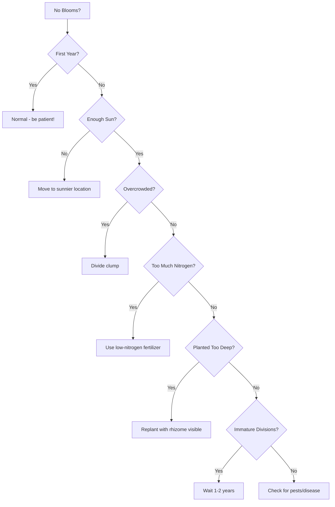

# Bearded Irises

> **"The bearded iris is the queen of the garden, with her velvet robes and regal bearing."**


**Bearded irises** (*Subgenus Iris*) are the **most popular and widely cultivated** irises in gardens worldwide. Named for the **fuzzy "beard"** on their lower petals (falls), these irises offer **unmatched color diversity, fragrance, and garden performance**.

## What Makes Them "Bearded"?

The **beard** is a **velvety patch** of specialized hairs (trichomes) on the **falls** (lower petals) of the flower:

```
Beard Structure:
├── **Location**: Center of each fall
├── **Composition**: Dense trichomes (hair-like structures)
├── **Color**: Often different from the fall color
├── **Function**: 
│   ├── Guides pollinators to nectar
│   ├── Provides tactile feedback
│   └── Enhances visual appeal
└── **Variation**: Can be white, yellow, orange, or matching the fall color
```

> **Fun Fact**: The beard isn't just decorative - it **helps bees and other pollinators** find their way to the nectar by providing both **visual contrast** and **tactile guidance**.

## Classification

Bearded irises are classified by **height** and **bloom size**:

### By Height

| **Class** | **Abbreviation** | **Height Range** | **Bloom Size** | **Stem Branching** | **Best For** |
|-----------|-----------------|------------------|----------------|-------------------|-------------|
| **Miniature Dwarf** | MDB | Up to 8" | Small | Simple | Rock gardens, containers |
| **Standard Dwarf** | SDB | 8-16" | Medium | Simple to branched | Borders, mass plantings |
| **Intermediate** | IB | 16-27.5" | Medium to large | Branched | Mid-border, cut flowers |
| **Miniature Tall** | MTB | 16-27.5" | Small to medium | Branched | Borders, cut flowers |
| **Border** | BB | 16-27.5" | Medium | Branched | Borders, mass plantings |
| **Tall** | TB | 27.5-48"+ | Large | Branched | Back of border, cut flowers |

### By Bloom Characteristics

| **Type** | **Description** | **Example Cultivars** |
|----------|-----------------|----------------------|
| **Self** | Uniform color | 'Blue Flag', 'Immortality' |
| **Bicolor** | Different colors on standards and falls | 'Conjuration', 'Debby Rairdon' |
| **Bitone** | Different shades of same color | 'Sea Power', 'Jesse's Song' |
| **Plicata** | Stitched or dotted edges | 'Honky Tonk Blues', 'Fancy That' |
| **Variegata** | Yellow/white with purple/red veining | 'Variegata', 'William Mohr' |
| **Amoena** | White standards, colored falls | 'Amoena', 'Roy Davidson' |
| **Neglecta** | Colored standards, white falls | 'Neglecta' (rare) |
| **Luminata** | Luminous, glowing appearance | 'Luminata', 'Thornbird' |
| **Patterned** | Complex patterns, veining | 'Haunted Heart', 'Dragon's Eye' |

## Top Cultivars

### 🏆 Award-Winning Tall Bearded Irises

| **Cultivar** | **Year** | **Color** | **Height** | **Awards** | **Breeder** |
|-------------|----------|-----------|------------|------------|------------|
| 'Beverly Sills' | 1985 | Deep purple | 36-40" | Dykes Medal 1991 | Ben Hager |
| 'Edith Wolford' | 1983 | White with purple edges | 36-40" | Dykes Medal 1989 | Orville Fay |
| 'Thornbird' | 1978 | Blue-purple | 36-40" | Dykes Medal 1984 | Paul Cook |
| 'Champagne Elegance' | 1993 | Cream with purple veins | 36-40" | Dykes Medal 1999 | Keith Keppel |
| 'Dusky Challenger' | 1973 | Deep purple | 36-40" | Dykes Medal 1979 | Ben Hager |
| 'Sea Power' | 1971 | Light blue, dark blue falls | 36-40" | Dykes Medal 1977 | Paul Cook |
| 'Celebration Song' | 1999 | Multicolored | 36-40" | Dykes Medal 2005 | Keith Keppel |

### 🌈 Color Categories

#### Purple & Blue

| **Cultivar** | **Shade** | **Height** | **Bloom Time** | **Fragrance** | **Special Features** |
|-------------|-----------|------------|---------------|---------------|-------------------|
| 'Beverly Sills' | Deep purple | 36-40" | Mid-May | Strong | Velvety texture |
| 'Before the Storm' | Black-purple | 36-40" | Mid-May | Moderate | Near-black appearance |
| 'Purple Hill' | Medium purple | 36-40" | Mid-May | Strong | Classic, reliable |
| 'Thornbird' | Blue-purple | 36-40" | Mid-May | Strong | Luminous quality |
| 'Sea Power' | Light/dark blue | 36-40" | Mid-May | Strong | Bicolor effect |
| 'Sable' | Deep purple-black | 36-40" | Mid-May | Moderate | Dramatic color |

#### Yellow & Gold

| **Cultivar** | **Shade** | **Height** | **Bloom Time** | **Fragrance** | **Special Features** |
|-------------|-----------|------------|---------------|---------------|-------------------|
| 'Butter and Sugar' | White & yellow | 36-40" | Mid-May | Strong | Bicolor classic |
| 'Sunny Disposition' | Bright yellow | 36-40" | Mid-May | Strong | Cheerful color |
| 'Lemon Chiffon' | Pale yellow | 36-40" | Mid-May | Strong | Soft, elegant |
| 'Gold Rush' | Golden yellow | 36-40" | Mid-May | Strong | Rich color |

#### White & Cream

| **Cultivar** | **Shade** | **Height** | **Bloom Time** | **Fragrance** | **Special Features** |
|-------------|-----------|------------|---------------|---------------|-------------------|
| 'Immortality' | Pure white | 36-40" | Mid-May | Strong | Classic white |
| 'Edith Wolford' | White with purple edges | 36-40" | Mid-May | Strong | Plicata pattern |
| 'Innocence' | Pure white | 36-40" | Mid-May | Strong | Simple elegance |
| 'Champagne Elegance' | Cream with purple veins | 36-40" | Mid-May | Strong | Sophisticated |

#### Pink & Rose

| **Cultivar** | **Shade** | **Height** | **Bloom Time** | **Fragrance** | **Special Features** |
|-------------|-----------|------------|---------------|---------------|-------------------|
| 'Pink Attraction' | Soft pink | 36-40" | Mid-May | Strong | Delicate color |
| 'Raspberry Blush' | Deep pink | 36-40" | Mid-May | Strong | Rich tone |
| 'First Prize' | Lavender-pink | 36-40" | Mid-May | Strong | Popular cut flower |

#### Bicolor & Patterned

| **Cultivar** | **Pattern** | **Height** | **Bloom Time** | **Fragrance** | **Special Features** |
|-------------|-------------|------------|---------------|---------------|-------------------|
| 'Conjuration' | Yellow standards, purple falls | 36-40" | Mid-May | Strong | Dramatic contrast |
| 'Honky Tonk Blues' | White with purple edges | 36-40" | Mid-May | Strong | Plicata pattern |
| 'Variegata' | Yellow/white with purple veins | 36-40" | Mid-May | Strong | Classic variegata |
| 'Haunted Heart' | White with dark purple center | 36-40" | Mid-May | Strong | Unique pattern |
| 'Dragon's Eye' | Complex veining | 36-40" | Mid-May | Strong | Intricate design |

### 🌸 Dwarf & Intermediate Bearded Irises

#### Miniature Dwarf Bearded (MDB)

| **Cultivar** | **Color** | **Height** | **Bloom Time** | **Fragrance** | **Best For** |
|-------------|-----------|------------|---------------|---------------|-------------|
| 'Blue Denim' | Medium blue | 6-8" | Early-Mid May | Strong | Rock gardens |
| 'Purple Hill' | Purple | 6-8" | Early-Mid May | Strong | Containers |
| 'Snow Flurry' | White | 6-8" | Early-Mid May | Strong | Edging |
| 'Lemon Lime' | Yellow | 6-8" | Early-Mid May | Strong | Mass plantings |

#### Standard Dwarf Bearded (SDB)

| **Cultivar** | **Color** | **Height** | **Bloom Time** | **Fragrance** | **Best For** |
|-------------|-----------|------------|---------------|---------------|-------------|
| 'Blue Denim' | Blue | 10-16" | Early-Mid May | Strong | Borders |
| 'Purple Hill' | Purple | 10-16" | Early-Mid May | Strong | Mass plantings |
| 'Butter and Sugar' | White & yellow | 10-16" | Early-Mid May | Strong | Borders |
| 'Iris pumila' | Purple | 10-16" | Early-Mid May | Strong | Species, natural look |

#### Intermediate Bearded (IB)

| **Cultivar** | **Color** | **Height** | **Bloom Time** | **Fragrance** | **Best For** |
|-------------|-----------|------------|---------------|---------------|-------------|
| 'Sugar Blues' | Blue | 16-27.5" | Mid-May | Strong | Mid-border |
| 'Jesse's Song' | Light blue | 16-27.5" | Mid-May | Strong | Cut flowers |
| 'Orchid Song' | Orchid-pink | 16-27.5" | Mid-May | Strong | Borders |

## Growing Bearded Irises

### 🌱 Basic Requirements

| **Factor** | **Ideal** | **Tolerates** | **Avoid** |
|------------|----------|--------------|-----------|
| **Sun** | 6-8 hours full sun | 4-6 hours | Deep shade |
| **Soil pH** | 6.8-7.0 (alkaline) | 6.5-7.5 | < 6.5 (acidic) |
| **Drainage** | Excellent | Good | Poor/standing water |
| **Soil Type** | Sandy loam | Clay loam | Heavy clay |
| **Moisture** | Dry to moderate | Moderate | Wet, soggy |
| **Fertility** | Low to moderate | High | Very high |

### 📅 Planting & Care Calendar

```
Bearded Iris Care Timeline:

🌱 **Early Spring** (March-April):
   - Remove winter mulch
   - Fertilize with low-nitrogen (6-10-10)
   - Check for heaving (press down exposed rhizomes)
   - Divide if needed (early spring or fall)

🌸 **Mid Spring** (April-May):
   - Water 1 inch per week if dry
   - Deadhead spent blooms
   - Stake tall varieties if needed
   - Monitor for pests

☀️ **Summer** (June-August):
   - Reduce watering (drought-tolerant)
   - Remove yellow/brown leaves
   - Divide 4-6 weeks after blooming
   - Order new rhizomes for fall planting

🍂 **Fall** (September-October):
   - Plant new rhizomes (6 weeks before frost)
   - Divide existing clumps
   - Fertilize with low-nitrogen (5-10-10)
   - Apply mulch after first frost

❄️ **Winter** (November-February):
   - Monitor mulch depth
   - Protect from freeze-thaw cycles
   - Check for rodent damage
```

### 🌿 Planting Guide

#### When to Plant

| **Region** | **Best Time** | **Alternative** | **Avoid** |
|------------|---------------|---------------|-----------|
| **Cold Climates** (Zones 3-5) | Late summer (Aug-Sept) | Early spring | Winter, late fall |
| **Moderate Climates** (Zones 6-8) | Early fall (Sept-Oct) | Early spring | Summer heat |
| **Warm Climates** (Zones 9-11) | Fall (Oct-Nov) | Late winter | Summer |

#### How to Plant

```md
**Step-by-Step Planting**:

1. **Prepare the Rhizome**:
   - Trim leaves to 6-8 inches (fan shape)
   - Remove dead or damaged roots
   - Soak in water for 1-2 hours (optional)

2. **Dig the Hole**:
   - Depth: 2-4 inches deep
   - Width: 12-18 inches wide
   - Space: 12-24 inches apart

3. **Create a Mound**:
   - Make a small mound in center
   - Prevents rhizome from sitting in water

4. **Plant the Rhizome**:
   - Place rhizome **on top of mound**
   - Spread roots **downward and outward**
   - **Top of rhizome must be visible** at soil surface

5. **Backfill**:
   - Cover roots with soil
   - **Do NOT cover rhizome**
   - Gently firm soil

6. **Water**:
   - Water **thoroughly** after planting
   - Keep soil **moist for first 2 weeks**

7. **Mulch** (Optional):
   - Apply 1-2 inches of mulch
   - **Keep mulch away from rhizome**
```

### 💧 Watering & Fertilizing

#### Watering Guide

| **Time** | **Frequency** | **Amount** | **Notes** |
|----------|--------------|-----------|-----------|
| **First 2 Weeks** | Daily | Keep moist | Critical for establishment |
| **First Month** | Weekly | 1 inch | Monitor for stress |
| **Growing Season** | Weekly | 1 inch | During dry spells |
| **Summer** | Every 2 weeks | 1 inch | Reduce in late summer |
| **Fall** | Weekly | 1 inch | Until first frost |
| **Winter** | None | None | Dormant period |

#### Fertilizing Schedule

| **Time** | **Type** | **Amount** | **Notes** |
|----------|----------|------------|-----------|
| **Early Spring** | Low-nitrogen (6-10-10) | 1/2 cup per plant | As new growth appears |
| **After Blooming** | Balanced (10-10-10) | 1/4 cup per plant | Helps rebuild energy |
| **Fall** | Low-nitrogen (5-10-10) | 1/4 cup per plant | 4-6 weeks before frost |

> **⚠️ Important**: **Never fertilize** in late summer or during dormancy.

### ➕ Division & Propagation

#### When to Divide

- **Best Time**: 4-6 weeks after blooming (July-August)
- **Alternative**: Early spring (before new growth)
- **Frequency**: Every **3-4 years**
- **Signs It's Time**: Reduced blooming, center die-out, overcrowding

#### How to Divide

```md
**Step-by-Step Division**:

1. **Prepare**:
   - Water clump 1-2 days before dividing
   - Cut back foliage to 6-8 inches
   - Gather tools (knife, fork, shears)

2. **Lift the Clump**:
   - Insert fork 12 inches from clump
   - Gently pry up entire clump
   - Shake off excess soil

3. **Separate Rhizomes**:
   - Identify natural divisions
   - Use hands or knife to separate
   - Disinfect knife between cuts
   - Each division needs 1-2 fans + rhizome + roots

4. **Trim & Prepare**:
   - Trim leaves to 6 inches
   - Remove dead/damaged roots
   - Check for pests/disease
   - Soak in water for 1-2 hours (optional)

5. **Replant**:
   - Plant at same depth (rhizome visible)
   - Space 12-24 inches apart
   - Water thoroughly
   - Do NOT fertilize for 4-6 weeks
```

### 🐛 Pest & Disease Management

#### Common Pests

| **Pest** | **Symptoms** | **Prevention** | **Treatment** |
|----------|--------------|---------------|---------------|
| **Iris Borer** | Ragged leaves, tunnels in rhizomes | Remove old foliage in fall, divide regularly | Dig up and destroy infested plants, apply Bt |
| **Aphids** | Curled leaves, sticky residue | Encourage beneficial insects | Spray with water, insecticidal soap |
| **Thrips** | Silvery streaks, distorted growth | Remove weeds, avoid overwatering | Neem oil, insecticidal soap |
| **Deer/Rabbits** | Eaten foliage/flowers | Fence garden, use repellents | Commercial repellents, motion sprinklers |

#### Common Diseases

| **Disease** | **Symptoms** | **Prevention** | **Treatment** |
|------------|--------------|---------------|---------------|
| **Bacterial Soft Rot** | Soft, mushy rhizomes, foul odor | Improve drainage, avoid overhead watering | Remove and destroy infected plants |
| **Leaf Spot** | Brown spots with yellow halos | Remove infected leaves, improve air circulation | Copper fungicide, remove infected leaves |
| **Root Rot** | Yellowing, wilting, soft roots | Improve drainage, avoid overwatering | Remove and destroy, solarize soil |

## Design Ideas with Bearded Irises

### 🎨 Color Themes

#### Monochromatic Gardens

| **Color** | **Cultivars** | **Companion Plants** | **Effect** |
|-----------|--------------|----------------------|------------|
| **Purple** | 'Beverly Sills', 'Before the Storm', 'Purple Hill' | Lavender, Allium, Salvia | Regal, dramatic |
| **Blue** | 'Thornbird', 'Sea Power', 'Sugar Blues' | Delphinium, Nepeta, Agastache | Cool, calming |
| **Yellow** | 'Butter and Sugar', 'Sunny Disposition', 'Gold Rush' | Coreopsis, Hemerocallis, Achillea | Cheerful, bright |
| **White** | 'Immortality', 'Edith Wolford', 'Innocence' | Shasta Daisy, Peony, Rosa | Elegant, pure |

#### Complementary Color Schemes

| **Primary Color** | **Complementary Color** | **Cultivars** | **Companion Plants** |
|------------------|------------------------|--------------|----------------------|
| **Purple** | Yellow | 'Beverly Sills' + 'Sunny Disposition' | Coreopsis, Rudbeckia |
| **Blue** | Orange | 'Thornbird' + 'Orange Harvest' | Marigold, Zinnia |
| **Yellow** | Purple | 'Butter and Sugar' + 'Purple Hill' | Salvia, Allium |

#### Analogous Color Schemes

| **Color Range** | **Cultivars** | **Companion Plants** | **Effect** |
|----------------|--------------|----------------------|------------|
| **Blue-Purple** | 'Sea Power', 'Thornbird', 'Beverly Sills' | Nepeta, Lavender, Geranium | Harmonious, cool |
| **Yellow-Orange** | 'Sunny Disposition', 'Gold Rush', 'Orange Harvest' | Coreopsis, Hemerocallis, Gaillardia | Warm, vibrant |
| **Pink-Purple** | 'Pink Attraction', 'Raspberry Blush', 'Beverly Sills' | Peony, Phlox, Rosa | Romantic, soft |

### 🌿 Garden Styles

#### Cottage Garden

**Design Tips:**
- Plant in **informal drifts**
- Mix with **other perennials** (peonies, roses, delphiniums)
- Use **tall varieties** (36-48") at back
- Add **dwarf varieties** at front
- Include **climbing roses** for vertical interest

**Recommended Cultivars:**
- 'Immortality' (white)
- 'Beverly Sills' (purple)
- 'Butter and Sugar' (bicolor)
- 'Thornbird' (blue-purple)

#### Formal Garden

**Design Tips:**
- Plant in **geometric patterns**
- Use **single color blocks**
- Create **symmetrical arrangements**
- Edge with **boxwood or lavender**
- Use **stakes** for tall varieties

**Recommended Cultivars:**
- 'Edith Wolford' (white with purple edges)
- 'Celebration Song' (multicolored)
- 'Champagne Elegance' (cream with purple veins)

#### Modern Garden

**Design Tips:**
- Use **bold color contrasts**
- Plant in **large masses**
- Combine with **ornamental grasses**
- Use **minimalist arrangements**
- Incorporate **hardscaping** (stone, metal)

**Recommended Cultivars:**
- 'Before the Storm' (black-purple)
- 'Dragon's Eye' (patterned)
- 'Haunted Heart' (white with dark center)

#### Rock Garden

**Design Tips:**
- Use **dwarf varieties** (MDB, SDB)
- Plant in **crevices and pockets**
- Combine with **other alpines**
- Use **well-drained soil**
- Add **mulch of gravel**

**Recommended Cultivars:**
- 'Blue Denim' (MDB, blue)
- 'Snow Flurry' (MDB, white)
- 'Lemon Lime' (MDB, yellow)
- 'Purple Hill' (SDB, purple)

#### Cut Flower Garden

**Design Tips:**
- Plant **tall varieties** (TB, IB)
- Space **18-24 inches apart**
- Use **stakes or cages** for support
- Plant in **rows for easy harvesting**
- Include **other cut flowers** (peonies, delphiniums, roses)

**Recommended Cultivars:**
- 'Beverly Sills' (purple, strong stems)
- 'Edith Wolford' (white/purple, long-lasting)
- 'Thornbird' (blue-purple, fragrant)
- 'Celebration Song' (multicolored, unique)

### 🌸 Companion Plants

#### Best Companions for Bearded Irises

| **Companion** | **Why It Works** | **Bloom Time** | **Height** | **Color Combinations** |
|---------------|------------------|---------------|------------|-----------------------|
| **Peony** | Similar care, complementary form | Late spring | 24-36" | Pink/white with purple irises |
| **Rose** | Classic combination, fragrance | Summer | 18-48" | Any color combination |
| **Lavender** | Contrasting form, similar conditions | Summer | 18-24" | Purple irises + purple lavender |
| **Salvia** | Vertical interest, attracts pollinators | Summer | 18-36" | Blue/purple with any iris |
| **Allium** | Dramatic spheres, pest deterrent | Late spring | 24-48" | Purple alliums + yellow irises |
| **Delphinium** | Vertical spikes, cool colors | Summer | 36-60" | Blue delphiniums + blue irises |
| **Daylily** | Long bloom season, easy care | Summer | 18-36" | Any color combination |
| **Catmint** | Ground cover, pest deterrent | Spring-Summer | 12-18" | Blue catmint + purple irises |
| **Ornamental Grass** | Contrasting texture, movement | Summer-Fall | 18-48" | Any color combination |
| **Daffodil** | Early spring color, pest deterrent | Early spring | 12-24" | Yellow daffodils + purple irises |

#### Plants to Avoid

| **Plant** | **Reason** | **Solution** |
|-----------|------------|-------------|
| **Hostas** | Prefers shade, different conditions | Plant in separate area |
| **Ferns** | Prefers shade, moist soil | Plant in separate area |
| **Hydrangeas** | Prefers acidic soil | Plant in separate area or amend soil |
| **Azaleas/Rhododendrons** | Prefers acidic soil | Plant in separate area or amend soil |
| **Impatiens** | Prefers shade, moist soil | Plant in separate area |

## Fragrance Guide

### 👃 Most Fragrant Bearded Irises

| **Cultivar** | **Fragrance Strength** | **Scent Description** | **Color** | **Bloom Time** |
|-------------|-----------------------|----------------------|-----------|---------------|
| 'Beverly Sills' | Very Strong | Sweet, floral | Deep purple | Mid-May |
| 'Edith Wolford' | Very Strong | Spicy, sweet | White/purple | Mid-May |
| 'Thornbird' | Very Strong | Grape-like | Blue-purple | Mid-May |
| 'Champagne Elegance' | Very Strong | Fruity, sweet | Cream/purple | Mid-May |
| 'Dusky Challenger' | Strong | Earthy, sweet | Deep purple | Mid-May |
| 'Sea Power' | Strong | Fresh, clean | Light/dark blue | Mid-May |
| 'Celebration Song' | Strong | Complex, sweet | Multicolored | Mid-May |
| 'Honky Tonk Blues' | Strong | Sweet, floral | White/purple | Mid-May |
| 'Conjuration' | Strong | Spicy, sweet | Yellow/purple | Mid-May |
| 'Variegata' | Moderate | Sweet, light | Yellow/white/purple | Mid-May |

### Fragrance Categories

| **Category** | **Description** | **Example Cultivars** | **Best Time to Enjoy** |
|--------------|-----------------|----------------------|------------------------|
| **Floral** | Sweet, flower-like | 'Beverly Sills', 'Edith Wolford' | Morning |
| **Spicy** | Warm, peppery | 'Conjuration', 'Thornbird' | Afternoon |
| **Fruity** | Grape, berry-like | 'Champagne Elegance', 'Sea Power' | Evening |
| **Earthy** | Rich, deep | 'Dusky Challenger', 'Before the Storm' | Morning |
| **Complex** | Multiple notes | 'Celebration Song', 'Haunted Heart' | All day |

## Reblooming Bearded Irises

### 🌸 What Are Rebloomers?

**Reblooming irises** (also called **remontant irises**) produce **two or more bloom cycles** in a single season:

- **First Bloom**: Spring (May-June)
- **Second Bloom**: Late summer to fall (August-September)
- **Some varieties**: May bloom **continuously**

### Top Reblooming Cultivars

| **Cultivar** | **First Bloom** | **Second Bloom** | **Color** | **Height** | **Hardiness** |
|-------------|----------------|------------------|-----------|------------|---------------|
| 'Celebration Song' | May | August-Sept | Multicolored | 36-40" | Zones 4-9 |
| 'Immortal' | May | August-Sept | White | 36-40" | Zones 4-9 |
| 'Jennifer Rebecca' | May | August-Sept | Pink | 36-40" | Zones 4-9 |
| 'Laced Cotton' | May | August-Sept | White with purple | 36-40" | Zones 4-9 |
| 'Purple Haze' | May | August-Sept | Purple | 36-40" | Zones 4-9 |
| 'Remontant' | May | August-Sept | Blue | 36-40" | Zones 4-9 |
| 'Rosalie Figge' | May | August-Sept | Pink | 36-40" | Zones 4-9 |
| 'Sugar Blues' | May | August-Sept | Blue | 16-27.5" | Zones 4-9 |

### Care for Reblooming Irises

```md
**Special Care Tips**:

✅ **DO**:
- Fertilize **after first bloom** (balanced fertilizer)
- Water **consistently** during summer
- Deadhead **first blooms** to encourage rebloom
- Divide **every 2-3 years** (more frequently than non-rebloomers)

❌ **DON'T**:
- **Over-fertilize** (can reduce reblooming)
- **Let soil dry out** completely in summer
- **Cut back foliage** after first bloom
- **Plant in deep shade** (needs full sun)
```

## Troubleshooting Guide

### 🚨 Common Problems & Solutions

| **Problem** | **Cause** | **Solution** |
|-------------|-----------|--------------|
| **No Blooms** | Too much shade, over-fertilizing, immature plants | Move to sunnier spot, reduce fertilizer, be patient |
| **Small Blooms** | Overcrowding, poor soil, lack of water | Divide clump, amend soil, water regularly |
| **Blind Stems** (no flowers, only leaves) | Late frost, over-fertilizing, stress | Protect from frost, reduce fertilizer, improve care |
| **Rotting Rhizomes** | Poor drainage, overwatering, deep planting | Improve drainage, reduce watering, plant shallower |
| **Yellow Leaves** | Overwatering, poor drainage, nutrient deficiency | Improve drainage, reduce watering, fertilize |
| **Leaf Spot** | Fungal disease, overhead watering | Remove infected leaves, improve air circulation, avoid overhead watering |
| **Iris Borer Damage** | Iris borer larvae | Remove old foliage in fall, divide regularly, apply nematodes |

### 🌱 Why Aren't My Irises Blooming?



## Where to Buy Bearded Irises

### 🌍 Reputable Nurseries

| **Nursery** | **Location** | **Specialty** | **Website** | **Notes** |
|-------------|--------------|--------------|-------------|-----------|
| **Schreiner's Iris Gardens** | Salem, OR | Bearded irises | schreinersgardens.com | One of the largest, great selection |
| **Aitken's Salmon Creek Iris Gardens** | Portland, OR | Bearded irises | aitkensiris.com | Family-owned, quality plants |
| **Cooley's Gardens** | Silverton, OR | Bearded irises | cooleysgardens.com | Historic nursery, excellent reputation |
| **Mid-America Iris Society** | Various | All types | midamericairissociety.org | Regional sales, shows |
| **American Iris Society** | National | All types | irises.org | Registry, shows, sales |

### 💡 Tips for Buying

```md
**What to Look For**:

✅ **Healthy Rhizomes**:
- **Firm and plump** (not shriveled or soft)
- **No signs of rot** (mushy, foul-smelling)
- **Good root system** (white, fibrous roots)
- **1-2 fans of leaves** (green, healthy)

✅ **Reputable Seller**:
- **Registered with AIS** (American Iris Society)
- **Good reviews** from other customers
- **Clear labeling** (name, color, height)
- **Disease-free guarantee**

✅ **Best Time to Buy**:
- **Late summer** (August-September) - best selection
- **Early fall** (October) - still good time to plant
- **Early spring** (March-April) - limited selection

❌ **Avoid**:
- **Rhizomes with no leaves** (may be dead or dormant)
- **Soft or mushy rhizomes** (sign of rot)
- **Rhizomes with no roots** (poor establishment)
- **Unlabeled plants** (unknown variety)
```

---

*Previous: [Species Overview](/iris/species) | Next: [Beardless Irises](/iris/species/beardless)*
