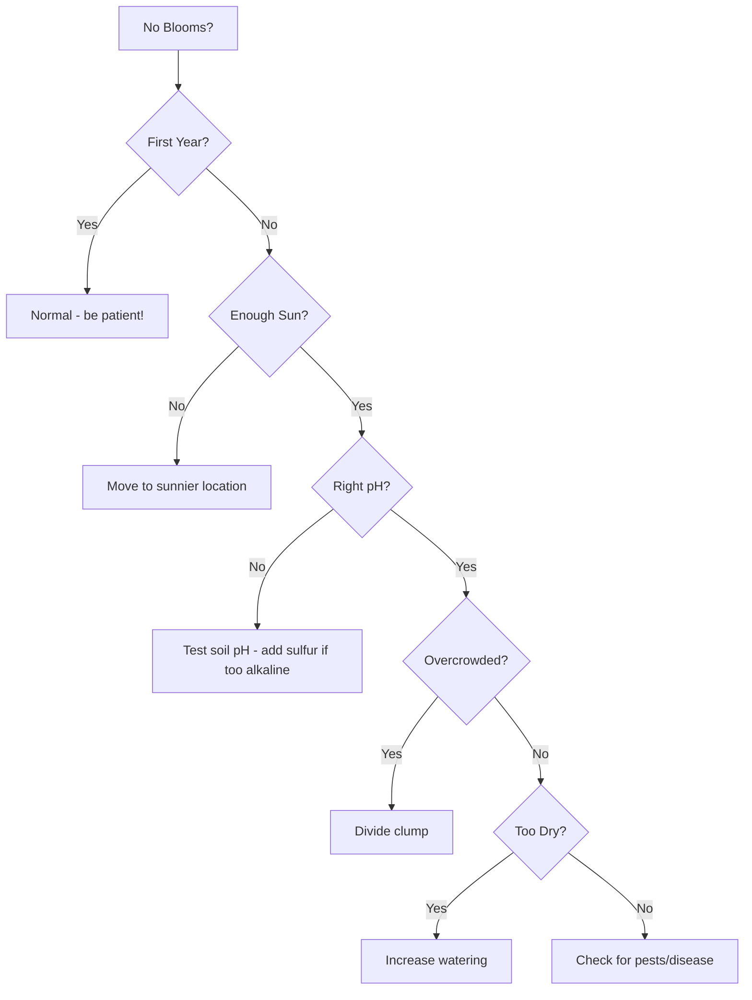

# Beardless Irises

> **"Graceful and refined, beardless irises bring elegance to the water's edge and beauty to the garden's heart."**


**Beardless irises** (*Subgenus Limniris*) are **elegant, water-loving irises** that lack the fuzzy beards found on their cousins. These irises are known for their **graceful form, love of moisture, and adaptability** to a variety of garden conditions.

## What Makes Them "Beardless"?

The **falls** (lower petals) of beardless irises are **smooth**, without the velvety patch of hairs found on bearded irises:

```
Beardless vs. Bearded Falls:
├── **Bearded Iris Falls**:
│   ├── Velvety "beard" of trichomes
│   ├── Often different color from fall
│   └── Tactile and visual guide for pollinators
│
└── **Beardless Iris Falls**:
    ├── Smooth surface
    ├── May have signal patches or veining
    └── Often more delicate appearance
```

> **Fun Fact**: While they lack beards, many beardless irises have **signal patches** - areas of contrasting color that serve a similar purpose in guiding pollinators.

## Classification

Beardless irises are divided into **series** based on their characteristics:

### Series Classification

| **Series** | **Characteristics** | **Example Species** | **Native Range** |
|------------|---------------------|---------------------|------------------|
| **Series *Limniris*** | True beardless irises | *I. versicolor*, *I. virginica* | North America |
| **Series *Tigridia*** | Tiger-like patterns | *I. ensata*, *I. laevigata* | Asia |
| **Series *Lophiris*** | Crested irises | *I. cristata*, *I. tectorum* | Asia, North America |

## Top Species & Cultivars

### 🌊 North American Native Species

#### *Iris versicolor* - Blue Flag Iris

```
Iris versicolor Profile:
├── **Common Names**: Blue Flag, Harlequin Blueflag, Larger Blue Flag
├── **Native Range**: Eastern North America (Canada to Virginia)
├── **Habitat**: Wet meadows, marshes, stream banks
├── **Height**: 24-36 inches
├── **Spread**: 18-24 inches
├── **Bloom Time**: May to July
├── **Flower Color**: Blue to purple with yellow signal
├── **Foliage**: Sword-shaped, green to blue-green
├── **Hardiness**: Zones 3-9
├── **Light**: Full sun to partial shade
├── **Soil**: Acidic to neutral (pH 5.5-6.5), moist to wet
├── **Moisture**: High (tolerates standing water)
├── **Propagation**: Division, seed
└── **Wildlife Value**: Attracts bees, butterflies
```

**Popular Cultivars:**
- 'Purple Hill' - Deep purple flowers
- 'Blue Flag' - Classic blue form
- 'Alba' - White form

**Growing Tips:**
- **Soil**: Prefers **acidic, organic-rich soil**
- **Water**: Keep **consistently moist**
- **Maintenance**: **Low** - very adaptable
- **Division**: Every **3-5 years**

---

#### *Iris virginica* - Virginia Iris

```
Iris virginica Profile:
├── **Common Names**: Virginia Blueflag, Southern Blue Flag
├── **Native Range**: Eastern North America (Virginia to Florida)
├── **Habitat**: Wet meadows, marshes, ditches
├── **Height**: 18-30 inches
├── **Spread**: 12-18 inches
├── **Bloom Time**: April to June
├── **Flower Color**: Blue to purple with white and yellow signals
├── **Foliage**: Sword-shaped, green
├── **Hardiness**: Zones 5-9
├── **Light**: Full sun to partial shade
├── **Soil**: Acidic to neutral (pH 5.5-6.5), moist to wet
├── **Moisture**: High
├── **Propagation**: Division, seed
└── **Wildlife Value**: Attracts pollinators
```

**Growing Tips:**
- **Soil**: Tolerates **clay soil**
- **Water**: **Drought-tolerant** once established
- **Maintenance**: **Very low**
- **Division**: Every **3-4 years**

---

### 🌸 Asian Species

#### *Iris ensata* - Japanese Iris

```
Iris ensata Profile:
├── **Common Names**: Japanese Iris, Japanese Water Iris
├── **Native Range**: Japan, Korea, China, Russia
├── **Habitat**: Marshes, wet meadows, pond edges
├── **Height**: 24-48 inches
├── **Spread**: 18-24 inches
├── **Bloom Time**: June to July
├── **Flower Color**: Purple, blue, white, pink (often with yellow signals)
├── **Flower Size**: 4-6 inches (very large!)
├── **Foliage**: Sword-shaped, green
├── **Hardiness**: Zones 4-9
├── **Light**: Full sun to partial shade
├── **Soil**: Acidic (pH 5.5-6.5), organic-rich
├── **Moisture**: High to very high (can grow in shallow water)
├── **Propagation**: Division
└── **Special Features**: Very large, showy flowers
```

**Popular Cultivars:**
- 'Echo Location' - Deep purple with white centers
- 'Lion King' - Rich purple with gold signals
- 'Variegata' - White with purple veins
- 'Rose Queen' - Soft pink
- 'Snowdrift' - Pure white

**Growing Tips:**
- **Soil**: **Must be acidic** - add sulfur if needed
- **Water**: **Keep soil consistently wet**
- **Planting**: Can be planted **in shallow water** (up to 2 inches deep)
- **Division**: Every **3-4 years**
- **Winter Care**: **Mulch heavily** in cold climates

---

#### *Iris laevigata* - Rabbit-Ear Iris

```
Iris laevigata Profile:
├── **Common Names**: Rabbit-Ear Iris, Smooth Iris
├── **Native Range**: Japan, Korea, China
├── **Habitat**: Wet meadows, stream banks
├── **Height**: 24-36 inches
├── **Spread**: 18-24 inches
├── **Bloom Time**: May to June
├── **Flower Color**: Purple, blue, white
├── **Flower Size**: 3-4 inches
├── **Foliage**: Sword-shaped, green
├── **Hardiness**: Zones 4-9
├── **Light**: Full sun to partial shade
├── **Soil**: Acidic to neutral (pH 5.5-7.0), moist
├── **Moisture**: Medium to high
├── **Propagation**: Division
└── **Special Features**: Very **hardy and adaptable**
```

**Growing Tips:**
- **Soil**: Tolerates a **wider pH range** than Japanese iris
- **Water**: Prefers **consistent moisture**
- **Maintenance**: **Very low**
- **Division**: Every **3-4 years**

---

### 🌿 Siberian Irises (*Iris sibirica*)

```
Iris sibirica Profile:
├── **Common Names**: Siberian Iris
├── **Native Range**: Central and Eastern Europe, Central Asia
├── **Habitat**: Meadows, forest edges, river banks
├── **Height**: 24-48 inches
├── **Spread**: 18-24 inches
├── **Bloom Time**: May to June
├── **Flower Color**: Blue, purple, white, yellow
├── **Flower Size**: 2-3 inches
├── **Foliage**: Grass-like, narrow, arching
├── **Hardiness**: Zones 3-9
├── **Light**: Full sun to partial shade
├── **Soil**: Acidic to neutral (pH 5.5-6.5), moist
├── **Moisture**: Medium to high
├── **Propagation**: Division
└── **Special Features**: **Very hardy**, **deer-resistant**, **long-lived**
```

**Popular Cultivars:**
- 'Caesar's Brother' - Deep purple (most popular!)
- 'Butter and Sugar' - White and yellow
- 'Blue King' - Rich blue
- 'Snow Queen' - Pure white
- 'Eric the Red' - Deep red-purple
- 'Shirley Pope' - White with yellow signals

**Growing Tips:**
- **Soil**: Prefers **organic-rich soil**
- **Water**: **Drought-tolerant** once established
- **Maintenance**: **Very low** - one of the easiest irises to grow
- **Division**: Every **3-4 years**
- **Pests**: **Deer-resistant**

---

### 🌺 Louisiana Irises

**Native to the Gulf Coast region**, these irises are **perfect for wet, humid climates**:

| **Species** | **Common Name** | **Height** | **Bloom Time** | **Flower Color** | **Hardiness** |
|-------------|----------------|------------|---------------|------------------|---------------|
| *Iris giganticaerulea* | Giant Blue Iris | 48-72" | April-May | Blue to purple | Zones 6-9 |
| *Iris hexagona* | Dixie Iris | 24-36" | April-May | Blue, purple | Zones 6-9 |
| *Iris nelsonii* | Abbeville Red Iris | 24-36" | April-May | Red-purple | Zones 6-9 |
| *Iris brevicaulis* | Zigzag Iris | 12-18" | April-May | Blue, purple | Zones 6-9 |

**Growing Tips:**
- **Soil**: **Acidic (pH 5.0-6.0)**
- **Water**: **Very high** - can grow in **standing water**
- **Light**: **Full sun**
- **Climate**: Best in **warm, humid climates**
- **Division**: Every **2-3 years**

---

### 🏔️ Crested Irises

**These irises have a ridge or crest instead of a beard:**

#### *Iris cristata* - Dwarf Crested Iris

```
Iris cristata Profile:
├── **Common Names**: Dwarf Crested Iris, Crested Iris
├── **Native Range**: Eastern North America
├── **Habitat**: Woodlands, forest edges
├── **Height**: 4-6 inches
├── **Spread**: 6-12 inches (spreading)
├── **Bloom Time**: April to May
├── **Flower Color**: Blue, purple, white
├── **Flower Size**: 2-3 inches
├── **Foliage**: Sword-shaped, green
├── **Hardiness**: Zones 4-8
├── **Light**: Partial shade to full shade
├── **Soil**: Acidic to neutral (pH 5.5-6.5), moist, organic-rich
├── **Moisture**: Medium
├── **Propagation**: Division, seed
└── **Special Features**: **Ground cover**, **shade-tolerant**, **spreading**
```

**Popular Cultivars:**
- 'Alba' - White
- 'Blue Form' - Blue
- 'Purple Form' - Purple
- 'Eco Bluebird' - Deep blue

**Growing Tips:**
- **Light**: One of the **few irises that tolerates shade**
- **Soil**: Prefers **organic-rich woodland soil**
- **Water**: Keep **moist but well-drained**
- **Maintenance**: **Very low**
- **Division**: Every **3-4 years**
- **Uses**: **Excellent ground cover** for shady areas

---

## Growing Beardless Irises

### 🌱 Basic Requirements

| **Factor** | **Siberian/Japanese** | **Louisiana** | **Blue Flag** | **Crested** |
|------------|----------------------|---------------|---------------|--------------|
| **Sun** | 6+ hours | 6+ hours | 6+ hours | Part shade |
| **Soil pH** | 5.5-6.5 (acidic) | 5.0-6.0 (acidic) | 5.5-6.5 (acidic) | 5.5-6.5 (acidic) |
| **Drainage** | Good | Poor (tolerates water) | Good to poor | Good |
| **Soil Type** | Loam, clay | Clay, organic | Loam, clay | Organic-rich |
| **Moisture** | Moist to wet | Wet to standing water | Moist to wet | Moist |
| **Fertility** | Moderate to high | High | Moderate | Moderate |

### 📅 Planting & Care Calendar

```
Beardless Iris Care Timeline:

🌱 **Early Spring** (March-April):
   - Remove winter mulch
   - Fertilize with **balanced fertilizer** (10-10-10)
   - Check for heaving
   - Divide if needed (early spring or fall)

🌸 **Mid Spring** (April-May):
   - Water **1-2 inches per week**
   - Deadhead spent blooms
   - Monitor for pests
   - Keep soil **consistently moist**

☀️ **Summer** (June-August):
   - **Siberian/Japanese**: Water **1-2 inches per week**
   - **Louisiana/Blue Flag**: Keep soil **wet**
   - Remove yellow/brown leaves
   - Divide **4-6 weeks after blooming**

🍂 **Fall** (September-October):
   - Plant new divisions
   - Fertilize with **low-nitrogen fertilizer** (5-10-10)
   - **Louisiana**: Continue watering until frost
   - Apply **mulch after first frost**

❄️ **Winter** (November-February):
   - **Siberian/Japanese**: Mulch **heavily** in cold climates
   - **Louisiana**: Mulch **very heavily** (protect from freezing)
   - **Crested**: Mulch **lightly**
```

### 🌿 Planting Guide

#### When to Plant

| **Region** | **Best Time** | **Alternative** | **Avoid** |
|------------|---------------|---------------|-----------|
| **Cold Climates** (Zones 3-5) | Early spring or early fall | Late summer | Winter, late fall |
| **Moderate Climates** (Zones 6-8) | Early fall or early spring | Late fall | Summer heat |
| **Warm Climates** (Zones 9-11) | Fall to early winter | Early spring | Summer |

#### How to Plant

```md
**Step-by-Step Planting for Beardless Irises**:

1. **Prepare the Rhizome**:
   - Trim leaves to **6-8 inches** (fan shape)
   - Remove **dead or damaged roots**
   - Soak in **water for 1-2 hours** (optional)

2. **Dig the Hole**:
   - Depth: **2-4 inches deep**
   - Width: **12-18 inches wide**
   - Space: **18-24 inches apart**

3. **Amend the Soil** (if needed):
   - For **acidic soil lovers**: Add **sulfur or peat moss**
   - For **organic matter**: Add **compost or well-rotted manure**

4. **Plant the Rhizome**:
   - Place rhizome **slightly below soil surface**
   - Spread roots **downward and outward**
   - **Top can be slightly covered** (unlike bearded irises)

5. **Backfill**:
   - Cover with **amended soil**
   - Gently **firm the soil**

6. **Water**:
   - Water **thoroughly** after planting
   - Keep soil **consistently moist** for first 4-6 weeks

7. **Mulch**:
   - Apply **2-3 inches of organic mulch**
   - Helps **retain moisture**
```

### 💧 Watering & Fertilizing

#### Watering Guide

| **Iris Type** | **Spring** | **Summer** | **Fall** | **Winter** | **Notes** |
|---------------|------------|-----------|-----------|-----------|-----------|
| **Siberian** | 1-2" per week | 1-2" per week | 1" per week | None | Drought-tolerant once established |
| **Japanese** | 1-2" per week | 1-2" per week | 1" per week | None | Keep soil **consistently moist** |
| **Louisiana** | 1-2" per week | 1-2" per week | 1" per week | None | **Tolerates standing water** |
| **Blue Flag** | 1-2" per week | 1-2" per week | 1" per week | None | Tolerates **wet conditions** |
| **Crested** | 1" per week | 1" per week | 1" per week | None | Prefers **moist but well-drained** |

#### Fertilizing Schedule

| **Time** | **Type** | **Amount** | **Notes** |
|----------|----------|------------|-----------|
| **Early Spring** | Balanced (10-10-10) | 1/4 cup per plant | As new growth appears |
| **After Blooming** | Balanced (10-10-10) | 1/4 cup per plant | Helps rebuild energy |
| **Fall** | Low-nitrogen (5-10-10) | 1/4 cup per plant | 4-6 weeks before frost |

> **⚠️ Important**: **Never fertilize** in late summer or during dormancy. Beardless irises **prefer more organic matter** than bearded irises.

### ➕ Division & Propagation

#### When to Divide

- **Best Time**: **Early spring** or **4-6 weeks after blooming**
- **Frequency**: Every **3-4 years** (Louisiana: every 2-3 years)
- **Signs It's Time**: Reduced blooming, center die-out, overcrowding

#### How to Divide

```md
**Step-by-Step Division for Beardless Irises**:

1. **Prepare the Clump**:
   - Water **1-2 days before dividing**
   - Cut back foliage to **6-8 inches**
   - Gather **sharp knife and garden fork**

2. **Lift the Clump**:
   - Insert fork **12 inches from clump**
   - Gently **pry up** entire clump
   - Shake off **excess soil**

3. **Separate the Rhizomes**:
   - Identify **natural divisions**
   - Use **hands or knife** to separate
   - **Disinfect knife** between cuts
   - Each division needs **2-3 fans + rhizome + roots**

4. **Trim & Prepare**:
   - Trim leaves to **6 inches**
   - Remove **dead/damaged roots**
   - Check for **pests/disease**

5. **Replant**:
   - Plant at **same depth**
   - Space **18-24 inches apart**
   - Water **thoroughly**
   - **Do NOT fertilize** for 4-6 weeks
```

## Design Ideas with Beardless Irises

### 🌊 Water Garden Designs

#### Pond Edge Planting

**Design Tips:**
- Plant **12-18 inches from water's edge**
- Use **Japanese or Louisiana irises** for wetter areas
- Combine with **other water plants** (cattails, rushes)
- Add **stones or mulch** to retain moisture
- Consider **container planting** in water

**Recommended Species:**
- *Iris ensata* (Japanese Iris)
- *Iris laevigata* (Rabbit-Ear Iris)
- *Iris pseudacorus* (Yellow Flag Iris)
- *Iris versicolor* (Blue Flag Iris)
- *Iris giganticaerulea* (Giant Blue Iris)

#### Rain Garden

**Design Tips:**
- Plant in **low-lying areas** that collect water
- Use **deep-rooted species** to absorb water
- Combine with **other water-tolerant plants**
- Add **mulch** to retain moisture

**Recommended Species:**
- *Iris versicolor* (Blue Flag Iris)
- *Iris virginica* (Virginia Iris)
- *Iris sibirica* (Siberian Iris)
- *Iris laevigata* (Rabbit-Ear Iris)

### 🌿 Woodland Garden

**Design Tips:**
- Use **crested irises** (*Iris cristata*) for **shade tolerance**
- Plant in **organic-rich soil**
- Combine with **other woodland plants** (hostas, ferns)
- Add **mulch** to retain moisture

**Recommended Species:**
- *Iris cristata* (Dwarf Crested Iris)
- *Iris tectorum* (Roof Iris)

### 🎨 Color Themes

#### Cool Color Garden (Blues & Purples)

| **Species** | **Cultivar** | **Height** | **Bloom Time** | **Companion Plants** |
|-------------|--------------|------------|---------------|----------------------|
| Japanese Iris | 'Echo Location' | 24-48" | June-July | Delphinium, Nepeta |
| Siberian Iris | 'Caesar's Brother' | 24-48" | May-June | Lavender, Salvia |
| Blue Flag Iris | 'Purple Hill' | 24-36" | May-July | Allium, Geranium |

#### White Garden

| **Species** | **Cultivar** | **Height** | **Bloom Time** | **Companion Plants** |
|-------------|--------------|------------|---------------|----------------------|
| Japanese Iris | 'Snowdrift' | 24-48" | June-July | Shasta Daisy, Peony |
| Siberian Iris | 'Snow Queen' | 24-48" | May-June | White Rosa, Astilbe |
| Crested Iris | 'Alba' | 4-6" | April-May | White Daffodil, Hellebore |

#### Mixed Color Border

**Design Tips:**
- Plant **tall varieties** (Japanese, Siberian) at back
- Use **medium varieties** (Blue Flag) in middle
- Add **dwarf varieties** (Crested) at front
- Combine with **other perennials** for continuous bloom

**Recommended Species:**
- Back: *Iris ensata* 'Echo Location' (Japanese)
- Middle: *Iris sibirica* 'Caesar's Brother' (Siberian)
- Front: *Iris cristata* 'Alba' (Crested)

### 🌸 Companion Plants

#### Best Companions for Beardless Irises

| **Companion** | **Why It Works** | **Bloom Time** | **Height** | **Best Iris Partners** |
|---------------|------------------|---------------|------------|------------------------|
| **Astilbe** | Similar moisture needs, contrasting form | Summer | 18-36" | Siberian, Japanese |
| **Cattail** | Water garden companion | Summer | 36-60" | Louisiana, Japanese |
| **Daylily** | Similar care, long bloom season | Summer | 18-36" | All beardless |
| **Hostas** | Shade companion for crested irises | Summer | 12-24" | Crested Iris |
| **Ferns** | Shade companion, contrasting texture | Spring-Summer | 12-36" | Crested Iris |
| **Rushes** | Water garden companion | Summer | 12-24" | Louisiana, Japanese |
| **Lobelia** | Water garden companion, blue flowers | Summer | 12-18" | Louisiana, Blue Flag |
| **Canna** | Water garden companion, bold foliage | Summer | 36-60" | Louisiana, Japanese |

#### Plants to Avoid

| **Plant** | **Reason** | **Solution** |
|-----------|------------|-------------|
| **Cacti/Succulents** | Prefers dry, well-drained soil | Plant in separate area |
| **Lavender** | Prefers dry, alkaline soil | Plant in separate area |
| **Rosemary** | Prefers dry, well-drained soil | Plant in separate area |

## Troubleshooting Guide

### 🚨 Common Problems & Solutions

| **Problem** | **Cause** | **Solution** |
|-------------|-----------|--------------|
| **No Blooms** | Too much shade, wrong pH, immature plants | Move to sunnier spot, test pH, be patient |
| **Yellow Leaves** | Wrong pH (too alkaline), overwatering | Test pH, add sulfur if needed, improve drainage |
| **Rotting Rhizomes** | Poor drainage, overwatering | Improve drainage, reduce watering |
| **Leaf Spot** | Fungal disease, overhead watering | Remove infected leaves, improve air circulation |
| **Poor Growth** | Wrong soil type, lack of nutrients | Amend soil, add organic matter |

### 🌱 Why Aren't My Beardless Irises Blooming?



## Where to Buy Beardless Irises

### 🌍 Reputable Nurseries

| **Nursery** | **Location** | **Specialty** | **Website** | **Notes** |
|-------------|--------------|--------------|-------------|-----------|
| **Ensata Gardens** | Michigan | Japanese Irises | ensatagardens.com | Specializes in Japanese irises |
| **Blue Flag Farms** | Oregon | Louisiana Irises | blueflagfarms.com | Louisiana iris specialists |
| **Cooley's Gardens** | Oregon | All types | cooleysgardens.com | Historic nursery, excellent selection |
| **Mid-America Iris Society** | Various | All types | midamericairissociety.org | Regional sales, shows |
| **American Iris Society** | National | All types | irises.org | Registry, shows, sales |

### 💡 Tips for Buying

```md
**What to Look For**:

✅ **Healthy Rhizomes**:
- **Firm and plump** (not shriveled or soft)
- **No signs of rot** (mushy, foul-smelling)
- **Good root system** (white, fibrous roots)
- **2-3 fans of leaves** (green, healthy)

✅ **Reputable Seller**:
- **Registered with AIS** (American Iris Society)
- **Good reviews** from other customers
- **Clear labeling** (name, species, height)
- **Disease-free guarantee**

✅ **Best Time to Buy**:
- **Early spring** (March-April) - best for planting
- **Early fall** (September-October) - good for planting
- **Late summer** (August) - limited selection

❌ **Avoid**:
- **Rhizomes with no leaves** (may be dead or dormant)
- **Soft or mushy rhizomes** (sign of rot)
- **Rhizomes with no roots** (poor establishment)
- **Unlabeled plants** (unknown variety)
```

---

*Previous: [Bearded Irises](/iris/species/bearded) | Next: [Bulbous Irises](/iris/species/bulbous)*
