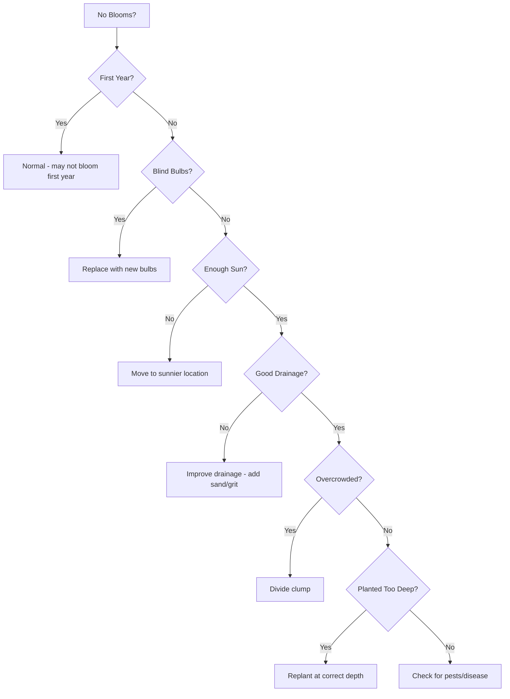

# Bulbous Irises

> **"The first heralds of spring, bulbous irises push through the snow to paint the garden with early color."**


**Bulbous irises** (*Subgenus Xiphium*) are **early spring bloomers** that grow from **true bulbs** rather than rhizomes. These irises are **perfect for early season color**, often blooming **before the last frost** has completely passed.

## What Makes Them "Bulbous"?

Unlike most irises that grow from **rhizomes** (horizontal underground stems), bulbous irises grow from **true bulbs** - **rounded, underground storage organs** with **fleshy scales**:

```
Bulb Structure:
├── **Tunic**: Outer protective layer (papery or fibrous)
├── **Scales**: Modified leaves that store food
├── **Basal Plate**: Bottom of bulb where roots emerge
├── **Apical Bud**: Growing point at the top
└── **Roots**: Fibrous roots emerging from basal plate
```

> **Fun Fact**: The **reticulate (net-veined) bulbs** of some species like *Iris reticulata* are **highly prized** by collectors for their **early bloom time** and **unique patterns**.

## Classification

Bulbous irises are divided into **three main groups**:

### 1. Reticulata Group

**Characteristics:**
- **Small, reticulate (net-veined) bulbs**
- **Very early spring bloom** (often through snow)
- **Dwarf size** (4-6 inches tall)
- **Fragrant flowers**

**Species:**
- *Iris reticulata* (Reticulata Iris)
- *Iris histrio* (Historion Iris)
- *Iris danfordiae* (Danford Iris)

---

### 2. Xiphium Group (Dutch Irises)

**Characteristics:**
- **Larger, smooth bulbs**
- **Early to mid-spring bloom**
- **Taller stature** (12-24 inches)
- **Excellent cut flowers**

**Species:**
- *Iris xiphium* (Dutch Iris)
- *Iris x hollandica* (Dutch Hybrid Iris)

---

### 3. Juno Group

**Characteristics:**
- **Bulb-like rhizomes with thick, fleshy roots**
- **Spring bloom**
- **Unique flower structure**
- **Drought-tolerant**

**Species:**
- *Iris bucHarica* (Bucharica Iris)
- *Iris junonia* (Juno Iris)
- *Iris orchioides* (Orchid-like Iris)

## Top Species & Cultivars

### 🌱 Reticulata Group

#### *Iris reticulata* - Reticulata Iris

```
Iris reticulata Profile:
├── **Common Names**: Reticulata Iris, Netted Iris
├── **Native Range**: Eastern Mediterranean (Turkey, Caucasus)
├── **Habitat**: Mountain meadows, rocky slopes
├── **Height**: 4-6 inches
├── **Spread**: 3-6 inches
├── **Bloom Time**: February to March (very early!)
├── **Flower Color**: Purple, blue, yellow, white
├── **Flower Size**: 2-3 inches
├── **Foliage**: Grass-like, narrow, 6-12 inches tall
├── **Hardiness**: Zones 5-9
├── **Light**: Full sun to partial shade
├── **Soil**: Well-drained, sandy or rocky
├── **Moisture**: Dry to moderate (drought-tolerant)
├── **Propagation**: Bulb offsets, seed
└── **Special Features**: **Very early bloom**, **fragrant**, **dwarf size**
```

**Popular Cultivars:**
- 'Harmony' - Deep purple with yellow signal
- 'George' - Rich purple
- 'Katharine Hodgkin' - Pale blue with yellow signal
- 'Alida' - Pale yellow
- 'Cantab' - Deep blue
- 'J.S. Dijt' - Violet-blue
- 'Pauline' - White with yellow signal

**Growing Tips:**
- **Planting Depth**: **4-6 inches deep**
- **Spacing**: **3-6 inches apart**
- **Soil**: **Must be well-drained** (rot in soggy soil)
- **Light**: **Full sun** for best blooming
- **Water**: **Dry to moderate** (drought-tolerant once established)
- **Fertilizer**: **Bone meal** at planting time
- **Division**: **Every 3-4 years** or when clumps become crowded
- **Naturalizing**: **Excellent** for rock gardens and naturalizing

---

#### *Iris histrio* - Historion Iris

```
Iris histrio Profile:
├── **Common Names**: Historion Iris
├── **Native Range**: Eastern Mediterranean (Turkey, Syria)
├── **Habitat**: Mountain meadows, rocky slopes
├── **Height**: 4-6 inches
├── **Spread**: 3-6 inches
├── **Bloom Time**: February to March
├── **Flower Color**: Purple, blue, yellow
├── **Flower Size**: 2-3 inches
├── **Foliage**: Grass-like, narrow
├── **Hardiness**: Zones 5-9
├── **Light**: Full sun to partial shade
├── **Soil**: Well-drained, sandy or rocky
├── **Moisture**: Dry to moderate
├── **Propagation**: Bulb offsets
└── **Special Features**: **Slightly larger flowers** than reticulata, **very fragrant**
```

**Popular Cultivars:**
- 'George' - Rich purple (also sold as reticulata)
- 'Lady Beatrice Stanley' - Pale blue with yellow
- 'Sheila Ann German' - Deep purple

---

#### *Iris danfordiae* - Danford Iris

```
Iris danfordiae Profile:
├── **Common Names**: Danford Iris
├── **Native Range**: Eastern Turkey
├── **Habitat**: Mountain meadows
├── **Height**: 4-6 inches
├── **Spread**: 3-6 inches
├── **Bloom Time**: February to March
├── **Flower Color**: Bright yellow with brown veining
├── **Flower Size**: 2-3 inches
├── **Foliage**: Grass-like, narrow
├── **Hardiness**: Zones 5-8
├── **Light**: Full sun to partial shade
├── **Soil**: Well-drained, sandy or rocky
├── **Moisture**: Dry to moderate
├── **Propagation**: Bulb offsets, seed
└── **Special Features**: **Bright yellow color** (rare in bulbous irises), **very early**
```

**Growing Tips:**
- **Soil**: **Must be well-drained**
- **Light**: **Full sun** for best blooming
- **Water**: **Dry conditions** preferred
- **Hardiness**: **Less cold-hardy** than reticulata (Zones 5-8)

---

### 🌷 Xiphium Group (Dutch Irises)

#### *Iris xiphium* - Dutch Iris

```
Iris xiphium Profile:
├── **Common Names**: Dutch Iris, Spanish Iris
├── **Native Range**: Spain, Portugal, North Africa
├── **Habitat**: Meadows, open woodlands
├── **Height**: 12-24 inches
├── **Spread**: 6-12 inches
├── **Bloom Time**: April to May
├── **Flower Color**: Blue, purple, yellow, white
├── **Flower Size**: 2-3 inches
├── **Foliage**: Grass-like, narrow, 12-18 inches tall
├── **Hardiness**: Zones 5-9
├── **Light**: Full sun to partial shade
├── **Soil**: Well-drained, sandy or loamy
├── **Moisture**: Dry to moderate
├── **Propagation**: Bulb offsets
└── **Special Features**: **Excellent cut flowers**, **taller stature**, **long vase life**
```

**Popular Cultivars:**
- 'Blue Magic' - Deep blue
- 'White Wedgwood' - Pure white
- 'Yellow Queen' - Bright yellow
- 'Purple Hill' - Rich purple
- 'Sapphire Beauty' - Blue-purple

**Growing Tips:**
- **Planting Depth**: **6-8 inches deep**
- **Spacing**: **6-12 inches apart**
- **Soil**: **Well-drained** (rot in soggy soil)
- **Light**: **Full sun** for best blooming
- **Water**: **Moderate** during growing season, **dry** in summer
- **Fertilizer**: **Bone meal** at planting time
- **Division**: **Every 3-4 years**
- **Cut Flowers**: **Excellent** - long stems, long vase life
- **Forcing**: Can be **forced indoors** for winter blooms

---

#### *Iris x hollandica* - Dutch Hybrid Iris

**These are hybrids** between *Iris xiphium* and other species, developed for **improved garden performance**:

**Popular Cultivars:**
- 'Telstar' - Deep purple
- 'Blue Magic' - Rich blue
- 'White Excelsior' - Pure white
- 'Golden Giant' - Bright yellow
- 'Purple Sensation' - Deep purple

**Growing Tips:**
- Same as **Dutch Iris** (*Iris xiphium*)
- **More reliable** bloomers than species
- **Better disease resistance**
- **Longer vase life** as cut flowers

---

### 🌺 Juno Group

#### *Iris bucHarica* - Bucharica Iris

```
Iris bucHarica Profile:
├── **Common Names**: Bucharica Iris
├── **Native Range**: Central Asia (Uzbekistan, Tajikistan)
├── **Habitat**: Mountain slopes, rocky areas
├── **Height**: 6-12 inches
├── **Spread**: 6-12 inches
├── **Bloom Time**: March to April
├── **Flower Color**: Purple, blue, yellow, white
├── **Flower Size**: 2-3 inches
├── **Foliage**: Basal fans, glaucous (blue-green)
├── **Hardiness**: Zones 5-9
├── **Light**: Full sun to partial shade
├── **Soil**: Well-drained, sandy or rocky
├── **Moisture**: Dry to moderate
├── **Propagation**: Bulb offsets
└── **Special Features**: **Unique flower structure**, **thick fleshy roots**, **drought-tolerant**
```

**Growing Tips:**
- **Soil**: **Must be well-drained** (rot in soggy soil)
- **Light**: **Full sun** for best blooming
- **Water**: **Dry conditions** preferred
- **Division**: **Every 3-4 years**

---

## Growing Bulbous Irises

### 🌱 Basic Requirements

| **Factor** | **Reticulata Group** | **Xiphium Group** | **Juno Group** |
|------------|----------------------|-------------------|----------------|
| **Sun** | Full sun to part shade | Full sun to part shade | Full sun to part shade |
| **Soil pH** | 6.0-7.0 (neutral) | 6.0-7.0 (neutral) | 6.0-7.0 (neutral) |
| **Drainage** | **Excellent** | **Excellent** | **Excellent** |
| **Soil Type** | Sandy, rocky | Sandy, loamy | Sandy, rocky |
| **Moisture** | Dry to moderate | Dry to moderate | Dry to moderate |
| **Fertility** | Low to moderate | Low to moderate | Low |

> **⚠️ Critical**: **All bulbous irises require excellent drainage** - they will **rot in soggy soil**!

### 📅 Planting & Care Calendar

```
Bulbous Iris Care Timeline:

🌱 **Early Spring** (March-April):
   - Remove winter mulch
   - Fertilize with **bone meal or bulb fertilizer**
   - Watch for **early blooms** (reticulata group)
   - Remove **spent blooms**

🌸 **Mid Spring** (April-May):
   - Water **1 inch per week** if dry
   - Deadhead **spent blooms**
   - Allow **foliage to die back naturally** (don't cut!)

☀️ **Summer** (June-August):
   - **Stop watering** (bulbs are dormant)
   - **Do NOT fertilize**
   - **Let foliage die back completely**
   - **Mark bulb locations** (for fall planting)

🍂 **Fall** (September-October):
   - **Plant new bulbs** (6 weeks before frost)
   - **Divide** existing clumps if needed
   - **Fertilize** with bone meal at planting
   - **Water** newly planted bulbs
   - Apply **mulch after first frost**

❄️ **Winter** (November-February):
   - **Mulch** to protect from freeze-thaw cycles
   - **Check** for rodent damage
   - **Avoid** walking on planting areas
```

### 🌿 Planting Guide

#### When to Plant

| **Region** | **Best Time** | **Alternative** | **Avoid** |
|------------|---------------|---------------|-----------|
| **Cold Climates** (Zones 3-5) | Early fall (Sept-Oct) | Early spring | Winter, late fall |
| **Moderate Climates** (Zones 6-8) | Fall (Oct-Nov) | Early spring | Summer |
| **Warm Climates** (Zones 9-11) | Fall to early winter | Late winter | Summer, late spring |

> **💡 Pro Tip**: **Plant bulbous irises in fall** to allow **root establishment** before winter. Spring planting is possible but may result in **reduced first-year blooms**.

#### How to Plant

```md
**Step-by-Step Planting for Bulbous Irises**:

1. **Prepare the Bulb**:
   - Choose **firm, plump bulbs**
   - Remove any **loose scales or damaged areas**
   - **Do NOT remove** the papery tunic

2. **Dig the Hole**:
   - **Reticulata Group**: 4-6 inches deep
   - **Xiphium Group**: 6-8 inches deep
   - **Juno Group**: 4-6 inches deep
   - **Spacing**: 3-12 inches apart (closer for dwarf, farther for tall)

3. **Amend the Soil** (if needed):
   - Add **sand or grit** to improve drainage
   - Add **bone meal** for root development
   - **Do NOT add** organic matter that retains moisture

4. **Plant the Bulb**:
   - Place bulb **pointy end up**
   - **Do NOT press** bulb into soil (can damage basal plate)
   - Cover with **soil**
   - Gently **firm the soil**

5. **Water**:
   - Water **thoroughly** after planting
   - Keep soil **moist for first 2-3 weeks**
   - **Do NOT overwater** (bulbs rot in soggy soil)

6. **Mulch** (Optional):
   - Apply **1-2 inches of gravel or sand**
   - **Do NOT use** organic mulch (retains too much moisture)
```

### 💧 Watering & Fertilizing

#### Watering Guide

| **Time** | **Frequency** | **Amount** | **Notes** |
|----------|--------------|-----------|-----------|
| **After Planting** | Weekly | Keep moist | Critical for root establishment |
| **Growing Season** | Weekly | 1 inch | During active growth and blooming |
| **After Blooming** | Reduce | 1/2 inch | As foliage begins to die back |
| **Summer** | **None** | None | Bulbs are **dormant** - do not water |
| **Fall** | Weekly | 1 inch | For newly planted bulbs |

> **⚠️ Important**: **Bulbous irises are drought-tolerant** and **prefer dry conditions** in summer. **Overwatering is the #1 cause of bulb rot**!

#### Fertilizing Schedule

| **Time** | **Type** | **Amount** | **Notes** |
|----------|----------|------------|-----------|
| **Planting Time** | Bone meal | 1 tbsp per bulb | Mix into planting hole |
| **Early Spring** | Bulb fertilizer (low-nitrogen) | 1/4 cup per sq ft | As new growth appears |
| **After Blooming** | Bulb fertilizer (low-nitrogen) | 1/4 cup per sq ft | Helps rebuild bulb |

> **⚠️ Important**: **Never use high-nitrogen fertilizer** - this promotes **leaf growth at the expense of flowers**.

### ➕ Division & Propagation

#### When to Divide

- **Best Time**: **Every 3-4 years** or when clumps become crowded
- **Signs It's Time**: Reduced blooming, overcrowding, smaller flowers
- **Time of Year**: **Fall** (after foliage dies back) or **early spring**

#### How to Divide

```md
**Step-by-Step Division for Bulbous Irises**:

1. **Prepare**:
   - Wait until **foliage has died back** (summer)
   - Gather **trowel and garden fork**

2. **Lift the Bulbs**:
   - Dig **carefully** around clump
   - Lift **entire clump** from soil
   - Shake off **excess soil**

3. **Separate the Bulbs**:
   - Gently **pull apart** bulb offsets
   - **Do NOT cut** - separate naturally
   - Discard **old, shriveled bulbs**
   - Keep **healthy, plump bulbs**

4. **Prepare for Replanting**:
   - Remove **loose scales**
   - Check for **pests or disease**
   - **Do NOT remove** tunic

5. **Replant**:
   - Plant at **same depth** as before
   - Space **3-12 inches apart**
   - Water **thoroughly**
   - **Do NOT fertilize** immediately
```

#### Propagation from Seed

```md
**Growing from Seed**:

1. **Collect Seeds**:
   - Allow **seed pods to mature** on plant
   - Harvest when **pods turn brown and split**
   - **Dry seeds** before storing

2. **Stratify Seeds** (for some species):
   - Mix with **moist sand**
   - Refrigerate for **4-8 weeks**

3. **Sow Seeds**:
   - Plant **1/4 inch deep** in well-drained soil
   - Keep **moist but not soggy**
   - **Germination**: 2-8 weeks

4. **Seedling Care**:
   - Grow in **partial shade** first year
   - **Do NOT expect blooms** for 2-3 years
   - Transplant to **garden** when large enough
```

## Design Ideas with Bulbous Irises

### 🌸 Early Spring Garden

**Design Tips:**
- Plant **reticulata irises** for **very early blooms** (February-March)
- Combine with **other early bloomers** (crocus, snowdrops, winter aconite)
- Use **dwarf varieties** at front of borders
- Plant in **rock gardens** for natural look
- Add **evergreen plants** for year-round interest

**Recommended Species:**
- *Iris reticulata* 'Harmony'
- *Iris histrio* 'George'
- *Iris danfordiae*

**Companion Plants:**
- Crocus
- Snowdrops (Galanthus)
- Winter Aconite (Eranthis)
- Dwarf Daffodils
- Hellebores

---

### 🪨 Rock Garden

**Design Tips:**
- Plant **reticulata and Juno irises** in **crevices and pockets**
- Use **well-drained, rocky soil**
- Combine with **other alpines** (saxifrages, sedums)
- Add **gravel mulch** to retain moisture
- Plant in **full sun** for best blooming

**Recommended Species:**
- *Iris reticulata* 'Katharine Hodgkin'
- *Iris histrio* 'Sheila Ann German'
- *Iris danfordiae*
- *Iris bucHarica*

**Companion Plants:**
- Saxifrages
- Sedums
- Sempervivums (Hens & Chicks)
- Alpine Pinks (Dianthus)
- Lewisia

---

### 🏡 Container Planting

**Design Tips:**
- Use **well-drained containers** (terracotta pots with drainage holes)
- Plant **3-5 bulbs per 8-inch pot**
- Use **sandy potting mix**
- Place in **full sun**
- **Overwinter** in garage or insulate in cold climates

**Recommended Species:**
- *Iris reticulata* (all cultivars)
- *Iris histrio* (all cultivars)
- *Iris danfordiae*

**Container Mix Recipe:**
- 50% **potting soil**
- 30% **perlite or pumice**
- 20% **sand**

---

### 🌷 Cut Flower Garden

**Design Tips:**
- Plant **Dutch irises** (*Iris xiphium*) for **excellent cut flowers**
- Space **6-12 inches apart** in rows
- Use **stakes or cages** for support
- Plant in **full sun** for strongest stems
- **Harvest** when buds show color

**Recommended Cultivars:**
- 'Blue Magic'
- 'White Wedgwood'
- 'Yellow Queen'
- 'Purple Hill'
- 'Telstar'

**Cut Flower Tips:**
- **Harvest** in **morning** when buds are **just opening**
- **Cut stems** at an angle
- **Remove** lower leaves
- **Place in water** immediately
- **Vase life**: 5-7 days

---

### 🌿 Naturalizing

**Design Tips:**
- Plant **reticulata irises** in **informal drifts**
- Choose **well-drained areas** (rocky slopes, meadows)
- **Do NOT mow** until foliage dies back
- **Divide** every 3-4 years to prevent overcrowding
- **Fertilize lightly** with bone meal

**Recommended Species:**
- *Iris reticulata* 'Harmony'
- *Iris histrio* 'George'
- *Iris danfordiae*

## Troubleshooting Guide

### 🚨 Common Problems & Solutions

| **Problem** | **Cause** | **Solution** |
|-------------|-----------|--------------|
| **No Blooms** | Blind bulbs, poor drainage, not enough sun | Replace bulbs, improve drainage, move to sunnier spot |
| **Blind Bulbs** (no flower, only foliage) | Immature bulbs, poor nutrition, stress | Be patient, fertilize with bone meal, improve care |
| **Rotting Bulbs** | Poor drainage, overwatering | Improve drainage, reduce watering, plant shallower |
| **Yellow Leaves** | Overwatering, poor drainage, nutrient deficiency | Improve drainage, reduce watering, fertilize |
| **Short Flower Stems** | Not enough sun, overcrowding | Move to sunnier spot, divide clump |
| **Pest Damage** (holes in leaves, tunnels in bulbs) | Iris borer, bulb mites | Remove and destroy infested bulbs, apply nematodes |

### 🌱 Why Aren't My Bulbous Irises Blooming?



## Forcing Bulbous Irises Indoors

### 🌸 How to Force Bulbous Irises

**Forcing** is the process of **tricking bulbs into blooming indoors** during winter:

```md
**Step-by-Step Forcing Guide**:

1. **Select Bulbs**:
   - Choose **large, healthy bulbs**
   - **Reticulata group** works best
   - **Dutch irises** can also be forced

2. **Pre-Chill Bulbs** (8-12 weeks):
   - Place bulbs in **paper bags or mesh bags**
   - Store in **refrigerator** (35-40°F)
   - **Do NOT freeze**
   - **Check weekly** for mold or sprouting

3. **Prepare Containers**:
   - Use **shallow containers** (4-6 inches deep)
   - Fill with **well-drained potting mix**
   - **No fertilizer** needed

4. **Plant Bulbs**:
   - Plant **bulbs pointy-end up**
   - **Cover with 1-2 inches of soil**
   - **Space 1-2 inches apart**
   - Water **lightly**

5. **Chill Period** (if not pre-chilled):
   - Place containers in **cool, dark place** (40-45°F)
   - **6-8 weeks** of chilling
   - Keep **slightly moist**

6. **Bring Indoors**:
   - Move to **cool, bright location** (50-60°F)
   - **Indirect light** at first
   - Gradually **increase light**

7. **Grow On**:
   - Move to **warmer location** (60-65°F) when shoots appear
   - **Bright, indirect light**
   - Keep **moist but not soggy**

8. **Enjoy Blooms**:
   - **Blooms appear** in 3-4 weeks
   - **Lasts 1-2 weeks**
   - **Discard bulbs** after blooming (won't rebloom)
```

### Forcing Timeline

```
Forcing Schedule (for February blooms):
├── **October 1**: Purchase bulbs
├── **October 15**: Begin pre-chilling (8-12 weeks)
├── **December 15**: Plant bulbs in containers
├── **December 15-January 15**: Chill period (if needed)
├── **January 15**: Bring indoors to cool, bright location
├── **February 1**: Move to warmer location with bright light
└── **February 15**: Enjoy blooms!
```

### Forcing Tips

```md
✅ **DO**:
- Use **large, healthy bulbs**
- **Pre-chill** bulbs for 8-12 weeks
- Keep **cool** (50-60°F) when shoots first appear
- Provide **bright, indirect light**
- Keep **moist but not soggy**

❌ **DON'T**:
- **Freeze** bulbs during chilling
- **Overwater** (bulbs rot easily)
- **Place in direct sun** when shoots first appear
- **Use high-nitrogen fertilizer**
- **Expect bulbs to rebloom** (discard after forcing)
```

## Where to Buy Bulbous Irises

### 🌍 Reputable Nurseries

| **Nursery** | **Location** | **Specialty** | **Website** | **Notes** |
|-------------|--------------|--------------|-------------|-----------|
| **Van Engelen** | Netherlands/USA | Dutch Irises | vanengelen.com | Bulb specialists, great selection |
| **Brent and Becky's Bulbs** | Virginia | All bulbous irises | brentandbeckysbulbs.com | Quality bulbs, good variety |
| **John Scheepers** | Connecticut | Reticulata irises | johnscheepers.com | Specializes in rare bulbs |
| **White Flower Farm** | Connecticut | All types | whiteflowerfarm.com | Reliable, high-quality |
| **Burpee** | Pennsylvania | Dutch Irises | burpee.com | Widely available, good prices |
| **Cooley's Gardens** | Oregon | All types | cooleysgardens.com | Historic nursery |

### 💡 Tips for Buying

```md
**What to Look For**:

✅ **Healthy Bulbs**:
- **Firm and plump** (not shriveled or soft)
- **No signs of rot** (mushy, foul-smelling)
- **No mold or damage**
- **Good size** (larger bulbs = more flowers)

✅ **Reputable Seller**:
- **Registered with** bulb societies
- **Good reviews** from other customers
- **Clear labeling** (name, color, height, bloom time)
- **Disease-free guarantee**

✅ **Best Time to Buy**:
- **Fall** (September-October) - best selection, best prices
- **Early spring** (March-April) - limited selection

❌ **Avoid**:
- **Soft or mushy bulbs** (sign of rot)
- **Sprouted bulbs** (unless you're forcing them)
- **Very small bulbs** (may not bloom first year)
- **Unlabeled bulbs** (unknown variety)
- **Bulbs stored in plastic** (can cause rot)
```

---

*Previous: [Beardless Irises](/iris/species/beardless) | Next: [Species Comparison](/iris/species/comparison)*
