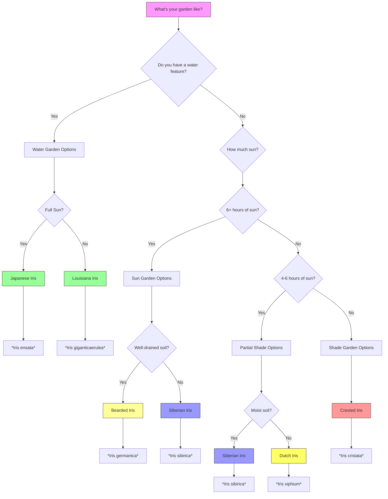

# Species Comparison Guide

> **"Choosing the right iris is like selecting the perfect paint color - it depends on your canvas, your light, and your vision."**

This **comprehensive comparison guide** helps you **select the perfect iris** for your garden by comparing all the major types side-by-side across multiple categories.

## Quick Comparison Chart

### 📊 At a Glance

| **Feature** | **Bearded Iris** | **Siberian Iris** | **Japanese Iris** | **Louisiana Iris** | **Reticulata Iris** | **Dutch Iris** | **Crested Iris** |
|-------------|------------------|-------------------|-------------------|--------------------|-------------------|----------------|------------------|
| **Subgenus** | *Iris* | *Limniris* | *Limniris* | *Limniris* | *Hermodactyloides* | *Xiphium* | *Lophiris* |
| **Growth Habit** | Rhizome | Rhizome | Rhizome | Rhizome | Bulb | Bulb | Rhizome |
| **Height** | 6-48" | 24-48" | 24-48" | 12-72" | 4-6" | 12-24" | 4-6" |
| **Bloom Time** | May-June | May-June | June-July | April-May | Feb-March | April-May | April-May |
| **Flower Size** | 3-6" | 2-3" | 4-6" | 3-5" | 2-3" | 2-3" | 2-3" |
| **Sun** | Full sun | Full sun to part shade | Full sun to part shade | Full sun | Full sun to part shade | Full sun to part shade | Part shade to full shade |
| **Soil pH** | 6.8-7.0 (alkaline) | 5.5-6.5 (acidic) | 5.5-6.5 (acidic) | 5.0-6.0 (acidic) | 6.0-7.0 (neutral) | 6.0-7.0 (neutral) | 5.5-6.5 (acidic) |
| **Moisture** | Dry to moderate | Moist to wet | Wet to moist | Wet to standing water | Dry to moderate | Dry to moderate | Moist |
| **Drainage** | Excellent | Good to excellent | Good | Good to poor | Excellent | Excellent | Good |
| **Hardiness** | Zones 3-9 | Zones 3-9 | Zones 4-9 | Zones 6-9 | Zones 5-9 | Zones 5-9 | Zones 4-8 |
| **Fragrance** | Strong to very strong | Mild to strong | Mild | Mild to strong | Strong | Mild | Mild |
| **Deer Resistance** | Moderate | High | Moderate | Moderate | High | Moderate | High |
| **Maintenance** | Low | Very low | Low | Low | Very low | Low | Very low |
| **Division Frequency** | Every 3-4 years | Every 3-4 years | Every 3-4 years | Every 2-3 years | Every 3-4 years | Every 3-4 years | Every 3-4 years |
| **Best For** | Sun gardens, borders | Wet areas, borders | Water gardens, ponds | Water gardens, warm climates | Rock gardens, early spring | Cut flowers, containers | Shade gardens, ground cover |

---

## Detailed Comparisons

### 🌱 Growth Habit Comparison

```
Growth Habit Types:

1. **Rhizomatous** (Bearded, Siberian, Japanese, Louisiana, Crested):
   ├── Horizontal underground stems
   ├── Spread by producing new rhizomes
   ├── Can be divided to propagate
   └── Rhizomes should be at or near soil surface

2. **Bulbous** (Reticulata, Dutch, Juno):
   ├── True bulbs (rounded storage organs)
   ├── Spread by producing bulb offsets
   ├── Can be divided when clumps become crowded
   └── Bulbs should be planted 3-4x their height deep
```

| **Type** | **Storage Organ** | **Spread Method** | **Planting Depth** | **Naturalizing** |
|----------|-------------------|-------------------|---------------------|------------------|
| Bearded | Rhizome | New rhizomes from mother | Surface visible | Good |
| Siberian | Rhizome | New rhizomes from mother | Slightly below surface | Excellent |
| Japanese | Rhizome | New rhizomes from mother | Slightly below surface | Good |
| Louisiana | Rhizome | New rhizomes from mother | Slightly below surface | Good |
| Reticulata | Bulb | Bulb offsets | 4-6" deep | Excellent |
| Dutch | Bulb | Bulb offsets | 6-8" deep | Good |
| Crested | Rhizome | New rhizomes from mother | Slightly below surface | Excellent |

---

### 🌸 Flower Characteristics Comparison

| **Type** | **Flower Shape** | **Falls** | **Standards** | **Style Arms** | **Color Range** | **Fragrance** |
|----------|------------------|-----------|---------------|----------------|-----------------|---------------|
| Bearded | Typical iris shape | Bearded (fuzzy) | Upright | Petal-like | Purple, blue, yellow, white, pink, black | Strong to very strong |
| Siberian | Typical iris shape | Smooth | Upright | Petal-like | Blue, purple, white, yellow | Mild to strong |
| Japanese | Large, flat | Smooth with signal | Upright | Petal-like | Purple, blue, white, pink | Mild |
| Louisiana | Typical iris shape | Smooth with signal | Upright | Petal-like | Blue, purple, red, white | Mild to strong |
| Reticulata | Small, delicate | Smooth with signal | Upright | Petal-like | Purple, blue, yellow, white | Strong |
| Dutch | Typical iris shape | Smooth | Upright | Petal-like | Blue, purple, yellow, white | Mild |
| Crested | Small, delicate | Crested (ridge) | Upright | Petal-like | Blue, purple, white | Mild |

---

### 🌍 Environmental Requirements Comparison

#### Sun Requirements

```
Sun Needs Visual:

Bearded Iris:     ☀️☀️☀️☀️☀️ (6-8 hours full sun)
Siberian Iris:    ☀️☀️☀️☀️ (4-6 hours, tolerates part shade)
Japanese Iris:    ☀️☀️☀️☀️ (4-6 hours, tolerates part shade)
Louisiana Iris:   ☀️☀️☀️☀️☀️ (6+ hours full sun)
Reticulata Iris:   ☀️☀️☀️☀️ (4-6 hours, tolerates part shade)
Dutch Iris:       ☀️☀️☀️☀️☀️ (6+ hours full sun)
Crested Iris:     ☀️☀️ (2-4 hours, tolerates full shade)
```

#### Soil pH Requirements

```
Soil pH Visual:

Bearded Iris:     🟡🟡🟡🟡 (6.8-7.0 - Alkaline)
Siberian Iris:    🟢🟢🟢 (5.5-6.5 - Acidic)
Japanese Iris:    🟢🟢🟢 (5.5-6.5 - Acidic)
Louisiana Iris:   🟢🟢 (5.0-6.0 - Very Acidic)
Reticulata Iris:   🟡🟡🟡 (6.0-7.0 - Neutral)
Dutch Iris:       🟡🟡🟡 (6.0-7.0 - Neutral)
Crested Iris:     🟢🟢🟢 (5.5-6.5 - Acidic)
```

#### Moisture Requirements

```
Moisture Needs Visual:

Bearded Iris:     💧 (Dry to moderate)
Siberian Iris:    💧💧💧 (Moist to wet)
Japanese Iris:    💧💧💧💧 (Wet to moist)
Louisiana Iris:   💧💧💧💧💧 (Wet to standing water)
Reticulata Iris:   💧 (Dry to moderate)
Dutch Iris:       💧 (Dry to moderate)
Crested Iris:     💧💧 (Moist)
```

---

### 📅 Seasonal Care Comparison

| **Task** | **Bearded** | **Siberian** | **Japanese** | **Louisiana** | **Reticulata** | **Dutch** | **Crested** |
|----------|-------------|--------------|--------------|---------------|----------------|-----------|-------------|
| **Planting Time** | Late summer, early fall | Early spring, early fall | Early spring, early fall | Early spring, early fall | Fall | Fall | Early spring, early fall |
| **Fertilizer Type** | Low-nitrogen | Balanced | Balanced | Balanced | Bulb fertilizer | Bulb fertilizer | Balanced |
| **Watering Frequency** | Low to moderate | High | High | Very high | Low | Low to moderate | Moderate |
| **Mulching** | Light (keep away from rhizome) | Heavy | Heavy | Very heavy | Light (gravel) | Light (gravel) | Moderate |
| **Division Time** | 4-6 weeks after bloom | 4-6 weeks after bloom | 4-6 weeks after bloom | 4-6 weeks after bloom | Fall | Fall | 4-6 weeks after bloom |
| **Winter Protection** | Mulch after frost | Heavy mulch | Heavy mulch | Very heavy mulch | Mulch | Mulch | Mulch |

---

## Garden Use Comparison

### 🎨 Design Applications

| **Garden Use** | **Bearded** | **Siberian** | **Japanese** | **Louisiana** | **Reticulata** | **Dutch** | **Crested** |
|---------------|-------------|--------------|--------------|---------------|----------------|-----------|-------------|
| **Borders** | ✅✅✅ | ✅✅✅ | ✅✅✅ | ✅✅ | ❌ | ✅✅✅ | ✅✅ |
| **Rock Gardens** | ✅✅ | ❌ | ❌ | ❌ | ✅✅✅ | ❌ | ✅✅✅ |
| **Water Gardens** | ❌ | ✅✅ | ✅✅✅ | ✅✅✅ | ❌ | ❌ | ❌ |
| **Containers** | ✅✅ | ✅ | ✅ | ❌ | ✅✅✅ | ✅✅✅ | ✅✅ |
| **Ground Cover** | ❌ | ❌ | ❌ | ❌ | ❌ | ❌ | ✅✅✅ |
| **Cut Flowers** | ✅✅✅ | ✅✅ | ✅✅✅ | ✅✅ | ❌ | ✅✅✅ | ❌ |
| **Naturalizing** | ✅✅ | ✅✅✅ | ✅✅ | ✅✅✅ | ✅✅✅ | ✅✅ | ✅✅✅ |
| **Shade Gardens** | ❌ | ✅ | ✅ | ❌ | ✅ | ❌ | ✅✅✅ |
| **Early Spring Color** | ❌ | ❌ | ❌ | ❌ | ✅✅✅ | ✅✅ | ❌ |

---

### 🌿 Companion Planting

| **Companion Type** | **Bearded** | **Siberian** | **Japanese** | **Louisiana** | **Reticulata** | **Dutch** | **Crested** |
|-------------------|-------------|--------------|--------------|---------------|----------------|-----------|-------------|
| **Other Perennials** | ✅✅✅ | ✅✅✅ | ✅✅✅ | ✅✅✅ | ✅✅ | ✅✅✅ | ✅✅✅ |
| **Water Plants** | ❌ | ✅✅✅ | ✅✅✅ | ✅✅✅ | ❌ | ❌ | ❌ |
| **Alpines** | ✅✅ | ❌ | ❌ | ❌ | ✅✅✅ | ❌ | ✅✅ |
| **Shrubs** | ✅✅ | ✅✅ | ✅✅ | ✅✅ | ❌ | ✅✅ | ✅✅ |
| **Trees** | ✅✅ | ✅✅ | ✅✅ | ✅✅ | ❌ | ✅✅ | ✅✅✅ |
| **Grasses** | ✅✅✅ | ✅✅ | ✅✅ | ✅✅ | ✅✅ | ✅✅ | ✅✅ |

---

## Maintenance Comparison

### 📋 Care Requirements

| **Care Aspect** | **Bearded** | **Siberian** | **Japanese** | **Louisiana** | **Reticulata** | **Dutch** | **Crested** |
|----------------|-------------|--------------|--------------|---------------|----------------|-----------|-------------|
| **Ease of Care** | Easy | Very Easy | Easy | Moderate | Very Easy | Easy | Very Easy |
| **Watering Needs** | Low to moderate | Moderate to high | High | Very high | Low | Low to moderate | Moderate |
| **Fertilizing Needs** | Low | Moderate | Moderate | Moderate | Low | Low | Moderate |
| **Pruning Needs** | Low (deadhead, remove old foliage) | Low (deadhead, remove old foliage) | Low (deadhead, remove old foliage) | Low (deadhead, remove old foliage) | Very low | Low | Very low |
| **Pest Resistance** | Moderate | High | Moderate | Moderate | High | Moderate | High |
| **Disease Resistance** | Moderate | High | Moderate | Moderate | High | Moderate | High |
| **Drought Tolerance** | High | Moderate | Low | Low | High | Moderate | Moderate |
| **Cold Hardiness** | High | High | Moderate | Low | Moderate | Moderate | High |
| **Heat Tolerance** | High | High | Moderate | High | Moderate | Moderate | Moderate |

---

## Cost Comparison

| **Type** | **Bulb/Rhizome Cost** | **Mature Plant Cost** | **Availability** | **Long-Term Value** |
|----------|----------------------|-----------------------|-----------------|---------------------|
| Bearded Iris | $5-$15 | $10-$25 | Very high | Excellent (long-lived) |
| Siberian Iris | $8-$20 | $15-$30 | High | Excellent (very hardy) |
| Japanese Iris | $10-$25 | $20-$40 | Moderate | Good (needs care) |
| Louisiana Iris | $10-$20 | $20-$35 | Low | Good (climate-specific) |
| Reticulata Iris | $3-$10 per bulb | $5-$15 per bulb | High | Excellent (naturalizes well) |
| Dutch Iris | $2-$8 per bulb | $5-$12 per bulb | Very high | Good (may need replacing) |
| Crested Iris | $8-$15 | $12-$20 | Moderate | Excellent (spreads well) |

---

## Climate Suitability

### 🌡️ Hardiness Zone Map

```mermaid
flowchart TD
    subgraph "Zones 3-4"
        A[Bearded Iris]
        B[Siberian Iris]
        C[Crested Iris]
    end
    
    subgraph "Zones 5-6"
        D[All Iris Types]
    end
    
    subgraph "Zones 7-8"
        E[All Iris Types]
    end
    
    subgraph "Zones 9-10"
        F[Bearded Iris]
        G[Siberian Iris]
        H[Japanese Iris]
        I[Louisiana Iris]
        J[Dutch Iris]
    end
    
    subgraph "Zones 11+"
        K[Bearded Iris\n(limited)]
        L[Dutch Iris]
    end
    
    style A fill:#f9f,stroke:#333
    style D fill:#9f9,stroke:#333
    style F fill:#99f,stroke:#333
    style K fill:#ff9,stroke:#333

### 🌡️ Temperature Tolerance

| **Type** | **Minimum Temperature** | **Maximum Temperature** | **Heat Tolerance** | **Cold Tolerance** |
|----------|------------------------|-------------------------|--------------------|-------------------|
| Bearded | -40°F (-40°C) | 100°F (38°C) | High | Very High |
| Siberian | -40°F (-40°C) | 95°F (35°C) | High | Very High |
| Japanese | -20°F (-29°C) | 90°F (32°C) | Moderate | High |
| Louisiana | 0°F (-18°C) | 100°F (38°C) | High | Moderate |
| Reticulata | -10°F (-23°C) | 90°F (32°C) | Moderate | Moderate |
| Dutch | -10°F (-23°C) | 90°F (32°C) | Moderate | Moderate |
| Crested | -20°F (-29°C) | 90°F (32°C) | Moderate | High |

---

## Bloom Time Comparison

### 📅 Seasonal Bloom Calendar

```
Bloom Time by Month:

January:    [Reticulata (warm climates)]
February:   [Reticulata, Dutch (warm climates)]
March:      [Reticulata, Dutch, Juno]
April:      [Dutch, Louisiana, Crested, Siberian (early)]
May:        [Bearded, Siberian, Japanese (early), Louisiana]
June:       [Bearded (late), Siberian (late), Japanese]
July:       [Japanese (late), Louisiana (late)]
August:     [Reblooming Bearded, Reblooming Siberian]
September:  [Reblooming Bearded, Reblooming Siberian]
```

### 🌸 Bloom Duration

| **Type** | **Individual Flower Duration** | **Total Bloom Period** | **Reblooming Potential** |
|----------|--------------------------------|------------------------|--------------------------|
| Bearded | 5-7 days | 2-3 weeks | Yes (some cultivars) |
| Siberian | 5-7 days | 2-3 weeks | Yes (some cultivars) |
| Japanese | 5-7 days | 2-3 weeks | No |
| Louisiana | 5-7 days | 2-3 weeks | No |
| Reticulata | 5-7 days | 1-2 weeks | No |
| Dutch | 5-7 days | 1-2 weeks | No |
| Crested | 5-7 days | 1-2 weeks | No |

---

## Special Features Comparison

### 🌟 Unique Characteristics

| **Feature** | **Bearded** | **Siberian** | **Japanese** | **Louisiana** | **Reticulata** | **Dutch** | **Crested** |
|------------|-------------|--------------|--------------|---------------|----------------|-----------|-------------|
| **Fragrance** | ✅✅✅ | ✅✅ | ✅ | ✅✅ | ✅✅✅ | ✅ | ✅ |
| **Cut Flower Quality** | ✅✅✅ | ✅✅ | ✅✅✅ | ✅✅ | ❌ | ✅✅✅ | ❌ |
| **Deer Resistance** | ✅✅ | ✅✅✅ | ✅✅ | ✅✅ | ✅✅✅ | ✅✅ | ✅✅✅ |
| **Rabbit Resistance** | ✅✅ | ✅✅✅ | ✅✅ | ✅✅ | ✅✅✅ | ✅✅ | ✅✅✅ |
| **Drought Tolerance** | ✅✅✅ | ✅✅ | ✅ | ✅ | ✅✅✅ | ✅✅ | ✅✅ |
| **Wet Soil Tolerance** | ❌ | ✅✅✅ | ✅✅✅ | ✅✅✅ | ❌ | ❌ | ✅ |
| **Shade Tolerance** | ❌ | ✅✅ | ✅✅ | ❌ | ✅✅ | ❌ | ✅✅✅ |
| **Salt Tolerance** | ✅ | ✅✅ | ✅ | ✅✅ | ✅ | ✅ | ✅ |
| **Pollinator Friendly** | ✅✅✅ | ✅✅✅ | ✅✅✅ | ✅✅✅ | ✅✅ | ✅✅ | ✅✅ |
| **Naturalizing Ability** | ✅✅ | ✅✅✅ | ✅✅ | ✅✅✅ | ✅✅✅ | ✅✅ | ✅✅✅ |

---

## Decision Tree: Which Iris is Right for You?



---

## Quick Selection Guide

### 🏆 Best for Specific Situations

| **Situation** | **Best Iris Type** | **Top Choices** | **Why?** |
|---------------|--------------------|-----------------|----------|
| **Beginner Gardener** | Siberian Iris | 'Caesar's Brother', 'Snow Queen' | Very easy, adaptable, low maintenance |
| **Early Spring Color** | Reticulata Iris | 'Harmony', 'Katharine Hodgkin' | Blooms in February-March |
| **Water Garden** | Japanese Iris | 'Echo Location', 'Lion King' | Loves wet conditions, large flowers |
| **Cut Flowers** | Dutch Iris | 'Blue Magic', 'White Wedgwood' | Long stems, long vase life |
| **Shade Garden** | Crested Iris | 'Alba', 'Blue Form' | Tolerates shade, good ground cover |
| **Rock Garden** | Reticulata Iris | 'Harmony', 'George' | Dwarf size, early bloom |
| **Naturalizing** | Siberian Iris | 'Caesar's Brother', 'Butter and Sugar' | Spreads well, low maintenance |
| **Fragrance** | Bearded Iris | 'Beverly Sills', 'Edith Wolford' | Strong fragrance |
| **Deer Resistance** | Siberian Iris | 'Caesar's Brother', 'Snow Queen' | Highly deer-resistant |
| **Wet Soil** | Louisiana Iris | *Iris giganticaerulea*, *Iris hexagona* | Tolerates standing water |
| **Dry Soil** | Bearded Iris | 'Immortality', 'Purple Hill' | Drought-tolerant |
| **Containers** | Reticulata Iris | 'Harmony', 'Katharine Hodgkin' | Small size, early bloom |
| **Reblooming** | Bearded Iris | 'Celebration Song', 'Immortal' | Blooms twice per season |

---

## Color Availability by Type

### 🎨 Color Palette Comparison

| **Color** | **Bearded** | **Siberian** | **Japanese** | **Louisiana** | **Reticulata** | **Dutch** | **Crested** |
|-----------|-------------|--------------|--------------|---------------|----------------|-----------|-------------|
| **Purple** | ✅✅✅ | ✅✅✅ | ✅✅✅ | ✅✅✅ | ✅✅✅ | ✅✅✅ | ✅✅✅ |
| **Blue** | ✅✅✅ | ✅✅✅ | ✅✅✅ | ✅✅✅ | ✅✅ | ✅✅✅ | ✅✅✅ |
| **Yellow** | ✅✅✅ | ✅✅ | ✅ | ✅ | ✅✅ | ✅✅✅ | ❌ |
| **White** | ✅✅✅ | ✅✅✅ | ✅✅✅ | ✅✅ | ✅✅ | ✅✅✅ | ✅✅✅ |
| **Pink** | ✅✅ | ✅✅ | ✅✅✅ | ✅✅ | ❌ | ❌ | ❌ |
| **Red** | ✅ | ❌ | ❌ | ✅✅ | ❌ | ❌ | ❌ |
| **Orange** | ✅ | ❌ | ❌ | ❌ | ❌ | ✅ | ❌ |
| **Black** | ✅✅ | ❌ | ❌ | ❌ | ❌ | ❌ | ❌ |
| **Bicolor** | ✅✅✅ | ✅✅ | ✅✅ | ✅✅ | ❌ | ✅ | ❌ |
| **Patterned** | ✅✅✅ | ❌ | ✅✅ | ✅✅ | ❌ | ❌ | ❌ |

---

## Final Recommendations

### 🌟 Top Picks by Garden Type

#### **Sun Garden (6+ hours of sun, well-drained soil)**
1. **Bearded Iris** (*Iris germanica*) - Classic, fragrant, many colors
2. **Dutch Iris** (*Iris xiphium*) - Excellent cut flowers
3. **Reticulata Iris** (*Iris reticulata*) - Early spring color

#### **Partial Shade Garden (4-6 hours of sun)**
1. **Siberian Iris** (*Iris sibirica*) - Very hardy, adaptable
2. **Japanese Iris** (*Iris ensata*) - Large, showy flowers
3. **Crested Iris** (*Iris cristata*) - Ground cover, shade-tolerant

#### **Water Garden (Wet to moist soil)**
1. **Japanese Iris** (*Iris ensata*) - Best for water gardens
2. **Louisiana Iris** (*Iris giganticaerulea*) - Tolerates standing water
3. **Siberian Iris** (*Iris sibirica*) - Moist to wet soil

#### **Rock Garden (Well-drained, rocky soil)**
1. **Reticulata Iris** (*Iris reticulata*) - Dwarf, early bloom
2. **Juno Iris** (*Iris bucHarica*) - Unique, drought-tolerant
3. **Crested Iris** (*Iris cristata*) - Small, spreading

#### **Shade Garden (2-4 hours of sun)**
1. **Crested Iris** (*Iris cristata*) - Best shade-tolerant iris
2. **Siberian Iris** (*Iris sibirica*) - Tolerates partial shade

#### **Container Garden**
1. **Reticulata Iris** (*Iris reticulata*) - Small size, early bloom
2. **Dutch Iris** (*Iris xiphium*) - Good cut flowers
3. **Dwarf Bearded Iris** (*Iris pumila*) - Compact, fragrant

---

*Previous: [Bulbous Irises](/iris/species/bulbous) | Next: [Resources Overview](/iris/resources)*
