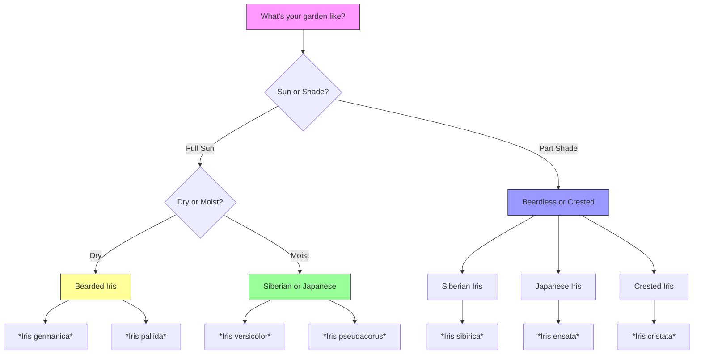

# Iris Species Directory

> **"The iris genus is a living rainbow, with over 300 species painting the world in every hue imaginable."**


This directory organizes the **vast world of irises** into manageable categories, helping you identify, compare, and select the perfect iris for your garden or collection.

## Species Classification

The **Iris genus** is divided into **six subgenera**, each with distinct characteristics:

### 🌿 Subgenus *Iris* (Bearded Irises)
The most popular garden irises, known for their **fuzzy "beards"** on the falls.

**Characteristics:**
- Thick, fleshy rhizomes
- Sword-like leaves
- Prefer **alkaline soil (pH 6.8-7.0)**
- **Drought-tolerant** once established

**Best for:** Sun gardens, borders, cut flowers

### 🌊 Subgenus *Limniris* (Beardless Irises)
Graceful irises that thrive in **moist to wet conditions**.

**Characteristics:**
- Slender, creeping rhizomes
- Smooth falls (no beards)
- Prefer **acidic soil (pH 5.5-6.5)**
- **Love water**

**Best for:** Pond edges, rain gardens, wet meadows

### 🌱 Subgenus *Xiphium* (Bulbous Irises)
Early spring bloomers that grow from **true bulbs**.

**Characteristics:**
- Grass-like foliage
- Early bloom time
- Prefer **well-drained soil**
- **Dwarf stature** (4-12 inches)

**Best for:** Rock gardens, containers, early spring color

### 🏔️ Subgenus *Nevskia* (Asian Irises)
Hardy irises from **Central Asia** with unique characteristics.

**Characteristics:**
- Slender, wiry rhizomes
- Small flowers with signal patches
- **Drought-tolerant**
- Grow in **dry, rocky soils**

**Best for:** Alpine gardens, dry slopes, specialty collections

### 🌸 Subgenus *Scorpiris* (Juno Irises)
Exotic irises with **bulb-like rhizomes** and thick roots.

**Characteristics:**
- Basal fans of glaucous leaves
- Unique flower structure
- **Spring bloomers**
- Prefer **well-drained soil**

**Best for:** Specialist collections, rock gardens

### ⚡ Subgenus *Hermodactyloides* (Reticulate Irises)
The **earliest bloomers**, often appearing through snow.

**Characteristics:**
- Small, reticulate (net-veined) bulbs
- **Very early spring** bloom
- Dwarf size (4-6 inches)
- Prefer **well-drained soil**

**Best for:** Early spring color, rock gardens, containers

---

## Species by Category

### 🏆 Most Popular Garden Irises

| **Species** | **Common Name** | **Type** | **Height** | **Bloom Time** | **Hardiness** | **Difficulty** |
|-------------|----------------|----------|------------|---------------|---------------|----------------|
| *Iris germanica* | Bearded Iris | Bearded | 28-48" | May-June | Zones 3-9 | Easy |
| *Iris versicolor* | Blue Flag Iris | Beardless | 24-36" | May-July | Zones 3-9 | Very Easy |
| *Iris pseudacorus* | Yellow Flag Iris | Beardless | 36-48" | May-June | Zones 5-9 | Easy |
| *Iris sibirica* | Siberian Iris | Beardless | 24-48" | May-June | Zones 3-9 | Very Easy |
| *Iris ensata* | Japanese Iris | Beardless | 24-48" | June-July | Zones 4-9 | Easy |
| *Iris reticulata* | Reticulata Iris | Bulbous | 4-6" | Feb-March | Zones 5-9 | Easy |

### 🌈 Color Champions

**Best for Specific Colors:**

| **Color** | **Species/Cultivar** | **Shade** | **Bloom Time** |
|-----------|---------------------|-----------|---------------|
| **Deep Purple** | *Iris germanica* 'Beverly Sills' | Velvety purple | May-June |
| **True Blue** | *Iris versicolor* | Sky blue | May-July |
| **Bright Yellow** | *Iris pseudacorus* | Golden yellow | May-June |
| **Pure White** | *Iris germanica* 'Immortality' | Snow white | May-June |
| **Black** | *Iris germanica* 'Before the Storm' | Deep purple-black | May-June |
| **Rainbow** | *Iris germanica* 'Celebration Song' | Multicolored | May-June |

### 🌍 Geographic Distribution

```mermaid
flowchart TD
    subgraph Europe
        A[Iris germanica]
        B[Iris pseudacorus]
        C[Iris foetidissima]
    end
    
    subgraph Asia
        D[Iris ensata]
        E[Iris sanguinea]
        F[Iris kolpakowskiana]
    end
    
    subgraph North America
        G[Iris versicolor]
        H[Iris virginica]
        I[Iris cristata]
    end
    
    subgraph Mediterranean
        J[Iris reticulata]
        K[Iris histrio]
        L[Iris unguicularis]
    end
    
    subgraph Middle East
        M[Iris persica]
        N[Iris meda]
    end
    
    style A fill:#f9f,stroke:#333
    style D fill:#9f9,stroke:#333
    style G fill:#99f,stroke:#333
    style J fill:#ff9,stroke:#333
    style M fill:#f99,stroke:#333

### 📏 Size Categories

| **Category** | **Height Range** | **Best For** | **Example Species** |
|--------------|-----------------|-------------|---------------------|
| **Dwarf** | Under 8" | Rock gardens, containers | *Iris cristata*, *Iris reticulata* |
| **Intermediate** | 8-28" | Borders, mass plantings | *Iris pumila*, *Iris histrio* |
| **Tall** | 28-48" | Back of borders, cut flowers | *Iris germanica*, *Iris pseudacorus* |
| **Giant** | Over 48" | Pond edges, wet areas | *Iris pseudacorus*, *Iris versicolor* |

### 🌱 Bloom Time Guide

```
Bloom Time Calendar:
├── **Very Early** (Jan-Feb): Reticulata, Histrio
├── **Early** (March-April): Dutch, Dwarf Bearded
├── **Mid** (May): Tall Bearded, Siberian
├── **Late** (June): Japanese, Louisiana
├── **Very Late** (July): Some Japanese, Louisiana
└── **Reblooming** (May + Aug-Sept): Reblooming Bearded, Siberian
```

### 💧 Moisture Preferences

| **Preference** | **Species** | **Soil** | **Location** |
|---------------|-------------|----------|-------------|
| **Very Dry** | *Iris germanica*, *Iris pallida* | Sandy, well-drained | Full sun |
| **Dry to Medium** | *Iris reticulata*, *Iris histrio* | Well-drained | Full sun to part shade |
| **Medium to Moist** | *Iris versicolor*, *Iris sibirica* | Loam | Part shade |
| **Moist to Wet** | *Iris pseudacorus*, *Iris ensata* | Clay, wet | Full sun to part shade |
| **Water** | *Iris laevigata*, *Iris virginica* | Aquatic | Pond edges |

---

## How to Use This Directory

### 🔍 **Identifying Your Iris**

1. **Check the leaves**: Sword-shaped = Bearded, Grass-like = Bulbous
2. **Look at the falls**: Bearded = fuzzy, Beardless = smooth
3. **Note the height**: Under 8" = Dwarf, Over 28" = Tall
4. **Observe bloom time**: Early spring = Bulbous, Summer = Beardless
5. **Consider habitat**: Dry = Bearded, Wet = Beardless

### 🌟 **Choosing the Right Iris**



### 📖 **Explore by Category**

- **[Bearded Irises](/iris/species/bearded)** - The classic garden iris
- **[Beardless Irises](/iris/species/beardless)** - Graceful water-loving varieties
- **[Bulbous Irises](/iris/species/bulbous)** - Early spring jewels
- **[Species Comparison](/iris/species/comparison)** - Side-by-side comparison chart

---

## Quick Reference: Top 10 Species for Beginners

| **Rank** | **Species** | **Type** | **Why It's Great** | **Best Variety** |
|----------|-------------|----------|-------------------|------------------|
| 1 | *Iris germanica* | Bearded | Easy to grow, many colors | 'Immortality' (white) |
| 2 | *Iris versicolor* | Beardless | Tolerates wet soil | 'Purple Hill' |
| 3 | *Iris sibirica* | Beardless | Very hardy, low maintenance | 'Caesar's Brother' |
| 4 | *Iris pseudacorus* | Beardless | Thrives in water | 'Yellow Flag' |
| 5 | *Iris reticulata* | Bulbous | Early spring blooms | 'Harmony' |
| 6 | *Iris cristata* | Crested | Dwarf, shade-tolerant | 'Alba' |
| 7 | *Iris ensata* | Beardless | Stunning large flowers | 'Echo Location' |
| 8 | *Iris pumila* | Bearded | Dwarf bearded | 'Blue Denim' |
| 9 | *Iris histrio* | Bulbous | Early, fragrant | 'George' |
| 10 | *Iris unguicularis* | Bulbous | Winter blooms | 'Mary Barnard' |

---

*Next: [Bearded Irises](/iris/species/bearded) | [Beardless Irises](/iris/species/beardless) | [Bulbous Irises](/iris/species/bulbous)*
